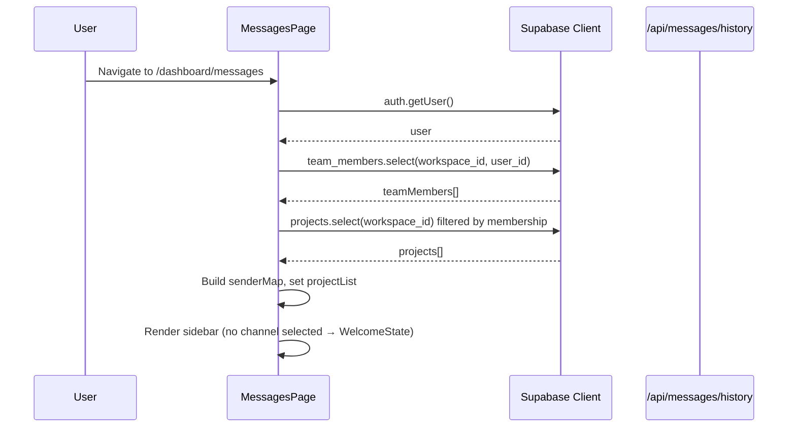
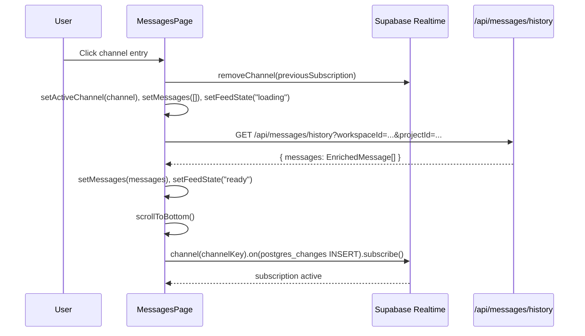
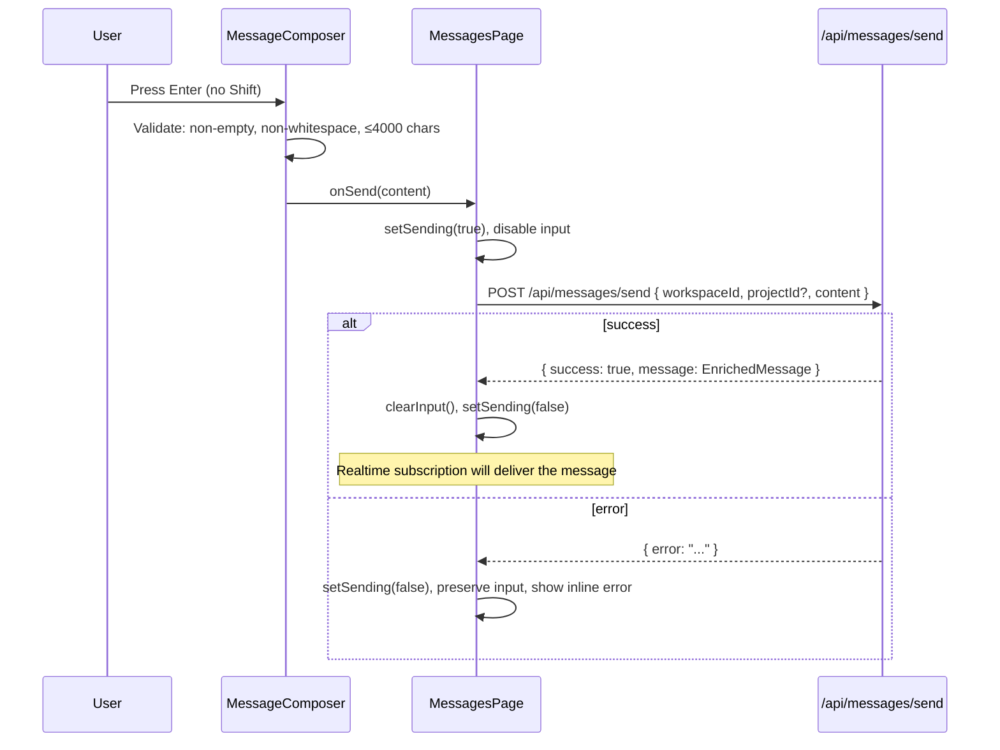
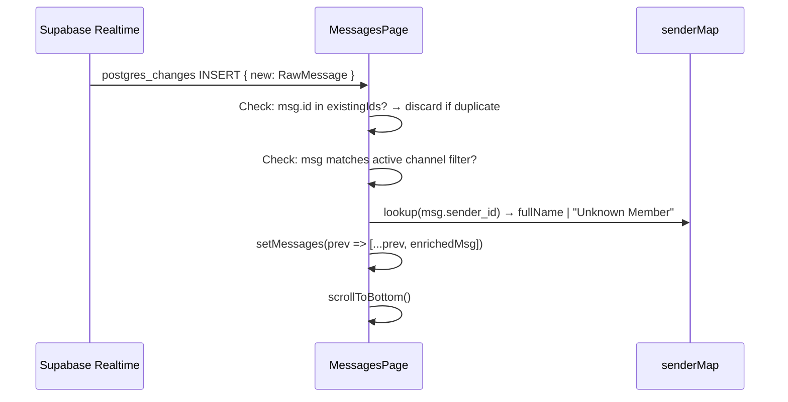

# Design Document: Slack-Like Messaging

## Overview

This document describes the technical design for rebuilding the APO messaging feature from scratch. The existing `/dashboard/messages` page and its API routes are broken and will be replaced entirely. The new implementation delivers a Slack-inspired real-time messaging experience with two channel types — a workspace-wide General channel and per-project channels — backed by Supabase Realtime, enforced by Row-Level Security, and rendered within the existing Next.js 15 App Router dashboard layout.

### Key Design Decisions

**Single-page client component with internal state machine.** The entire messaging UI lives in one `"use client"` page component that manages channel selection, message history, realtime subscription lifecycle, and composition state. Sub-components are extracted for clarity but do not own state.

**No re-fetch on realtime events.** The existing broken implementation calls `fetchHistory()` on every realtime INSERT, which causes flicker and defeats the purpose of realtime. The new design appends incoming messages directly to local state after enriching them with sender names from a pre-loaded team member map.

**Sender name resolution via client-side map.** Team members for the workspace are loaded once on mount and stored in a `Map<userId, fullName>`. This map is used both to enrich history messages (avoiding N+1 queries) and to resolve sender names for incoming realtime events without additional API calls.

**Textarea instead of input for composition.** The requirement for Shift+Enter newlines requires a `<textarea>` element, not `<input type="text">`. The textarea auto-resizes up to a max height.

**5-minute grouping window for Message_Groups.** Consecutive messages from the same sender are grouped only if they are within 5 minutes of each other, matching Requirement 9.3.

**Project membership enforced at two layers.** RLS policies enforce access at the database level. The API routes perform an explicit membership check before querying, returning HTTP 403 before any database query for non-members, providing defense in depth.

---

## Architecture

### Component Tree

```
MessagesPage (page.tsx) — "use client", owns all state
├── MessagesSidebar
│   ├── SidebarSection ("Workspace")
│   │   └── ChannelEntry (General)
│   └── SidebarSection ("Projects")
│       └── ChannelEntry × N (per project)
├── WelcomeState (when no channel selected)
└── ChannelView (when channel selected)
    ├── ChannelHeader
    ├── MessageFeed
    │   ├── LoadingState
    │   ├── ErrorState
    │   ├── EmptyState
    │   └── MessageGroup × N
    │       ├── GroupHeader (sender name + timestamp)
    │       └── MessageBubble × N
    └── MessageComposer
```

### Data Flow

```
MessagesPage
  │
  ├─ onMount: loadWorkspaceData()
  │    ├─ supabase.auth.getUser()
  │    ├─ team_members → builds senderMap: Map<userId, fullName>
  │    └─ projects (user's projects) → sets projectList
  │
  ├─ onChannelSelect(channel): switchChannel()
  │    ├─ unsubscribe previous realtime channel
  │    ├─ setActiveChannel(channel)
  │    ├─ fetchHistory(channel) → GET /api/messages/history
  │    └─ subscribeRealtime(channel)
  │
  ├─ onRealtimeInsert(payload):
  │    ├─ deduplicate by id
  │    ├─ enrich with senderMap
  │    └─ setMessages(prev => [...prev, enriched])
  │
  └─ onSend(content): sendMessage()
       ├─ validate content
       ├─ POST /api/messages/send
       └─ on success: clearInput()
```

### Sequence Diagrams

#### Initial Load



#### Channel Switch



#### Send Message



#### Realtime Message Receive



---

## Components and Interfaces

### TypeScript Interfaces

```typescript
// Core domain types
interface RawMessage {
  id: string;
  workspace_id: string;
  project_id: string | null;
  sender_id: string;
  receiver_id: string | null;
  content: string;
  created_at: string;
}

interface EnrichedMessage extends RawMessage {
  sender: {
    user_id: string;
    full_name: string; // "Unknown Member" if not found
  };
}

interface MessageGroup {
  senderId: string;
  senderName: string;
  timestamp: string; // ISO string of first message in group
  messages: EnrichedMessage[];
}

type ChannelType = "general" | "project";

interface ActiveChannel {
  type: ChannelType;
  id: string;        // workspace_id for general, project_id for project
  name: string;      // "General" or project name (truncated to 25 chars in sidebar)
  workspaceId: string;
}

type FeedState = "idle" | "loading" | "ready" | "error";
type SendState = "idle" | "sending" | "error";

interface WorkspaceProject {
  id: string;
  name: string;
}

interface TeamMember {
  user_id: string;
  full_name: string;
}
```

### Component Interfaces

```typescript
// MessagesPage — owns all state, no props (Next.js page)
// Internal state:
//   user: User | null
//   workspaceId: string | null
//   projects: WorkspaceProject[]
//   senderMap: Map<string, string>  // userId → fullName
//   activeChannel: ActiveChannel | null
//   messages: EnrichedMessage[]
//   feedState: FeedState
//   sendState: SendState
//   sendError: string | null
//   connectionError: boolean

interface MessagesSidebarProps {
  workspaceId: string | null;
  projects: WorkspaceProject[];
  activeChannel: ActiveChannel | null;
  onSelectChannel: (channel: ActiveChannel) => void;
}

interface ChannelEntryProps {
  channel: ActiveChannel;
  isActive: boolean;
  onSelect: (channel: ActiveChannel) => void;
}

interface ChannelViewProps {
  activeChannel: ActiveChannel;
  messages: EnrichedMessage[];
  feedState: FeedState;
  sendState: SendState;
  sendError: string | null;
  connectionError: boolean;
  currentUserId: string;
  onSend: (content: string) => Promise<void>;
  onRetry: () => void;
}

interface ChannelHeaderProps {
  channel: ActiveChannel;
  connectionError: boolean;
}

interface MessageFeedProps {
  messages: EnrichedMessage[];
  feedState: FeedState;
  currentUserId: string;
  scrollRef: React.RefObject<HTMLDivElement>;
  onRetry: () => void;
}

interface MessageGroupProps {
  group: MessageGroup;
  isCurrentUser: boolean;
}

interface MessageBubbleProps {
  message: EnrichedMessage;
  isCurrentUser: boolean;
}

interface MessageComposerProps {
  channelName: string;
  sendState: SendState;
  sendError: string | null;
  onSend: (content: string) => Promise<void>;
}
```

### Grouping Algorithm

Messages are grouped into `MessageGroup[]` using a pure function:

```typescript
function groupMessages(
  messages: EnrichedMessage[],
  GROUP_WINDOW_MS = 5 * 60 * 1000
): MessageGroup[] {
  const groups: MessageGroup[] = [];
  for (const msg of messages) {
    const last = groups[groups.length - 1];
    const msgTime = new Date(msg.created_at).getTime();
    const lastTime = last
      ? new Date(last.messages[last.messages.length - 1].created_at).getTime()
      : -Infinity;
    if (
      last &&
      last.senderId === msg.sender_id &&
      msgTime - lastTime <= GROUP_WINDOW_MS
    ) {
      last.messages.push(msg);
    } else {
      groups.push({
        senderId: msg.sender_id,
        senderName: msg.sender.full_name,
        timestamp: msg.created_at,
        messages: [msg],
      });
    }
  }
  return groups;
}
```

---

## API Contracts

### GET /api/messages/history

**Runtime:** `nodejs`

**Query Parameters:**

| Parameter     | Type   | Required | Description                                      |
|---------------|--------|----------|--------------------------------------------------|
| `workspaceId` | string | Yes      | UUID of the workspace                            |
| `projectId`   | string | No       | UUID of the project; omit for General channel    |

**Success Response (200):**
```json
{
  "success": true,
  "messages": [
    {
      "id": "uuid",
      "workspace_id": "uuid",
      "project_id": "uuid | null",
      "sender_id": "uuid",
      "receiver_id": null,
      "content": "Hello team",
      "created_at": "2025-01-01T10:00:00Z",
      "sender": {
        "user_id": "uuid",
        "full_name": "Jane Smith"
      }
    }
  ]
}
```

**Error Responses:**

| Status | Condition                                                        |
|--------|------------------------------------------------------------------|
| 400    | `workspaceId` missing                                            |
| 401    | No authenticated session                                         |
| 403    | User is not a member of the workspace                            |
| 403    | `projectId` provided but user is not a member of that project    |
| 500    | Unexpected database error                                        |

**Server-side Logic:**
1. Authenticate via `supabase.auth.getUser()` — return 401 if no session.
2. Verify workspace membership: `SELECT 1 FROM team_members WHERE user_id = auth.uid() AND workspace_id = $workspaceId` — return 403 if no row.
3. If `projectId` provided, verify project membership: `SELECT 1 FROM team_members WHERE user_id = auth.uid() AND workspace_id = $workspaceId` and project exists in workspace — return 403 if not a member.
4. Query messages with appropriate filter (project_id IS NULL for general, project_id = $projectId for project channel).
5. Fetch sender names in a single batch query on `team_members`.
6. Return enriched messages ordered ascending by `created_at`, limited to 50.

---

### POST /api/messages/send

**Runtime:** `nodejs`

**Request Body:**
```json
{
  "workspaceId": "uuid",
  "projectId": "uuid | null",
  "content": "Hello team"
}
```

**Validation Rules:**
- `workspaceId`: required, non-empty string
- `content`: required, non-empty after trim, not solely whitespace, max 4000 characters
- `projectId`: optional; if provided, user must be a project member

**Success Response (200):**
```json
{
  "success": true,
  "message": {
    "id": "uuid",
    "workspace_id": "uuid",
    "project_id": "uuid | null",
    "sender_id": "uuid",
    "receiver_id": null,
    "content": "Hello team",
    "created_at": "2025-01-01T10:00:00Z",
    "sender": {
      "user_id": "uuid",
      "full_name": "Jane Smith"
    }
  }
}
```

**Error Responses:**

| Status | Condition                                                        |
|--------|------------------------------------------------------------------|
| 400    | Missing `workspaceId` or `content`; content exceeds 4000 chars  |
| 401    | No authenticated session                                         |
| 403    | User is not a member of the workspace                            |
| 403    | `projectId` provided but user is not a project member            |
| 500    | Unexpected database error                                        |

**Server-side Logic:**
1. Authenticate — return 401 if no session.
2. Validate body fields — return 400 if invalid.
3. Verify workspace membership — return 403 if not a member.
4. If `projectId` provided, verify project membership — return 403 if not a member.
5. Insert message with `sender_id = auth.uid()`, `receiver_id = NULL`.
6. Fetch sender's `full_name` from `team_members`.
7. Return enriched message.

---

## Data Models

### messages Table (existing, no schema changes required)

```sql
CREATE TABLE public.messages (
  id           uuid        DEFAULT gen_random_uuid() PRIMARY KEY,
  workspace_id uuid        NOT NULL,
  project_id   uuid,                    -- NULL = General channel
  sender_id    uuid        NOT NULL REFERENCES auth.users(id) ON DELETE CASCADE,
  receiver_id  uuid,                    -- NULL for channel messages (DMs out of scope)
  content      text        NOT NULL,
  created_at   timestamptz DEFAULT now()
);
```

**Indexes to add for performance:**

```sql
-- History query: workspace + project filter + ordering
CREATE INDEX IF NOT EXISTS idx_messages_workspace_project_created
  ON public.messages (workspace_id, project_id, created_at ASC);

-- General channel query (project_id IS NULL)
CREATE INDEX IF NOT EXISTS idx_messages_workspace_general
  ON public.messages (workspace_id, created_at ASC)
  WHERE project_id IS NULL AND receiver_id IS NULL;
```

### RLS Policy Updates

The existing RLS policies are insufficient — they do not enforce project membership for project channels. The following replaces the existing policies:

```sql
-- Drop existing policies
DROP POLICY IF EXISTS "Read workspace messages" ON public.messages;
DROP POLICY IF EXISTS "Read direct messages" ON public.messages;
DROP POLICY IF EXISTS "Send messages" ON public.messages;

-- Policy 1: SELECT — General channel (project_id IS NULL)
-- Any workspace member can read general channel messages
CREATE POLICY "select_general_channel_messages" ON public.messages
  FOR SELECT USING (
    project_id IS NULL
    AND receiver_id IS NULL
    AND workspace_id IN (
      SELECT workspace_id FROM public.team_members
      WHERE user_id = auth.uid()
    )
  );

-- Policy 2: SELECT — Project channel messages
-- Only workspace members who are also project members can read
CREATE POLICY "select_project_channel_messages" ON public.messages
  FOR SELECT USING (
    project_id IS NOT NULL
    AND workspace_id IN (
      SELECT workspace_id FROM public.team_members
      WHERE user_id = auth.uid()
    )
    AND project_id IN (
      SELECT p.id FROM public.projects p
      INNER JOIN public.team_members tm
        ON tm.workspace_id = p.workspace_id
        AND tm.user_id = auth.uid()
      WHERE p.id = messages.project_id
    )
  );

-- Policy 3: INSERT — General channel
CREATE POLICY "insert_general_channel_messages" ON public.messages
  FOR INSERT WITH CHECK (
    auth.uid() = sender_id
    AND project_id IS NULL
    AND receiver_id IS NULL
    AND workspace_id IN (
      SELECT workspace_id FROM public.team_members
      WHERE user_id = auth.uid()
    )
  );

-- Policy 4: INSERT — Project channel
CREATE POLICY "insert_project_channel_messages" ON public.messages
  FOR INSERT WITH CHECK (
    auth.uid() = sender_id
    AND project_id IS NOT NULL
    AND workspace_id IN (
      SELECT workspace_id FROM public.team_members
      WHERE user_id = auth.uid()
    )
    AND project_id IN (
      SELECT p.id FROM public.projects p
      INNER JOIN public.team_members tm
        ON tm.workspace_id = p.workspace_id
        AND tm.user_id = auth.uid()
      WHERE p.id = messages.project_id
    )
  );
```

**Note on project membership model:** The current schema uses `team_members` with `workspace_id` but does not have a separate `project_members` table. Project membership is inferred by the existence of a `team_members` row for the same `workspace_id` combined with the project being in that workspace. If a more granular project membership model is needed in the future, a `project_members` table should be added. For now, all workspace members are considered members of all projects in that workspace — the sidebar filters projects by `workspace_id` only.

> **Design Note:** Given that `team_members` only has `workspace_id` (not `project_id`), the RLS policies for project channels simplify to: any workspace member can access any project channel in their workspace. The API-level 403 for project access (Requirements 2.4, 8.5) is enforced by verifying the project exists in the workspace. This is consistent with the existing data model.

### Realtime Subscription

**Channel naming convention:**

```typescript
// General channel
const channelKey = `messages:workspace:${workspaceId}`;

// Project channel  
const channelKey = `messages:project:${projectId}`;
```

**Subscription filter:**

```typescript
// General channel subscription
supabase
  .channel(channelKey)
  .on("postgres_changes", {
    event: "INSERT",
    schema: "public",
    table: "messages",
    filter: `workspace_id=eq.${workspaceId}`,
  }, handleInsert)
  .subscribe(handleStatus);

// Project channel subscription
supabase
  .channel(channelKey)
  .on("postgres_changes", {
    event: "INSERT",
    schema: "public",
    table: "messages",
    filter: `project_id=eq.${projectId}`,
  }, handleInsert)
  .subscribe(handleStatus);
```

**Subscription lifecycle:**

```typescript
// In MessagesPage, managed via useEffect with activeChannel dependency
useEffect(() => {
  if (!activeChannel) return;

  const channelKey = activeChannel.type === "general"
    ? `messages:workspace:${activeChannel.workspaceId}`
    : `messages:project:${activeChannel.id}`;

  const filter = activeChannel.type === "general"
    ? `workspace_id=eq.${activeChannel.workspaceId}`
    : `project_id=eq.${activeChannel.id}`;

  const sub = supabase
    .channel(channelKey)
    .on("postgres_changes", { event: "INSERT", schema: "public", table: "messages", filter }, (payload) => {
      const raw = payload.new as RawMessage;
      // Deduplication
      setMessages(prev => {
        if (prev.some(m => m.id === raw.id)) return prev;
        // Filter: for general channel, skip messages with project_id
        if (activeChannel.type === "general" && raw.project_id !== null) return prev;
        const enriched: EnrichedMessage = {
          ...raw,
          sender: {
            user_id: raw.sender_id,
            full_name: senderMapRef.current.get(raw.sender_id) ?? "Unknown Member",
          },
        };
        return [...prev, enriched];
      });
      scrollToBottom();
    })
    .subscribe((status) => {
      setConnectionError(status === "CHANNEL_ERROR" || status === "TIMED_OUT");
    });

  return () => { supabase.removeChannel(sub); };
}, [activeChannel]);
```

**Note on senderMap in realtime handler:** The `senderMap` is stored in a `useRef` (not `useState`) so the realtime callback always has access to the latest map without needing to be in the dependency array, avoiding subscription churn.

---

## Correctness Properties

*A property is a characteristic or behavior that should hold true across all valid executions of a system — essentially, a formal statement about what the system should do. Properties serve as the bridge between human-readable specifications and machine-verifiable correctness guarantees.*

### Property Reflection

Before listing properties, redundancies identified in prework:

- **4.1 and 4.4** both describe the same grouping behavior (sender name shown only at group start). Merged into Property 5.
- **6.6 and 9.7** both describe whitespace rejection. Merged into Property 7.
- **6.7 and 9.8** both describe Shift+Enter behavior. These are UI interaction examples, not properties — excluded.
- **2.1 and 2.5** (sidebar inclusion/exclusion) are two sides of the same membership filter. Merged into Property 2.
- **8.3, 8.4, 8.5** all describe HTTP 403/401 access control. Merged into Property 9.

---

### Property 1: General channel filter correctness

*For any* workspace with a mix of general-channel messages (project_id IS NULL, receiver_id IS NULL) and project-channel messages (project_id IS NOT NULL), querying the history endpoint without a `projectId` parameter should return only messages where `project_id IS NULL` and `receiver_id IS NULL`.

**Validates: Requirements 1.2**

---

### Property 2: Sidebar membership filter

*For any* set of projects in a workspace, the Channel_Sidebar should display exactly the projects the current user is a member of — no more, no fewer. Projects the user is not a member of must not appear; projects the user is a member of must all appear.

**Validates: Requirements 2.1, 2.5**

---

### Property 3: Project channel filter correctness

*For any* project_id and workspace_id, the history endpoint should return only messages where both `project_id` and `workspace_id` match the requested values exactly. No messages from other projects or other workspaces should appear.

**Validates: Requirements 2.2**

---

### Property 4: Insert payload correctness

*For any* valid message content sent in a channel, the row inserted into the `messages` table should have `sender_id = auth.uid()`, `receiver_id = NULL`, `workspace_id` equal to the current workspace, and `project_id` equal to the selected project's id (or NULL for the General channel).

**Validates: Requirements 1.3, 2.3**

---

### Property 5: Message grouping invariant

*For any* sequence of `EnrichedMessage` objects ordered ascending by `created_at`, the `groupMessages` function should produce groups where: (a) every message in a group has the same `sender_id`, (b) consecutive messages within a group are no more than 5 minutes apart, and (c) the first message of each group is the only one that would display a sender name header.

**Validates: Requirements 4.1, 4.4, 9.3**

---

### Property 6: Sender name resolution

*For any* `EnrichedMessage`, the `sender.full_name` field should equal the `full_name` from `team_members` for the matching `user_id` and `workspace_id`. If no matching record exists, or if `full_name` is null or blank, the value should be exactly `"Unknown Member"`.

**Validates: Requirements 4.2, 4.3**

---

### Property 7: Whitespace content rejection

*For any* string composed entirely of whitespace characters (spaces, tabs, newlines, or any combination thereof), attempting to submit it as a message should not call the send API and should not clear the Message_Input field.

**Validates: Requirements 6.6, 9.7**

---

### Property 8: Realtime deduplication

*For any* current Message_Feed state containing a message with id `X`, receiving a realtime INSERT event for a message with the same id `X` should leave the Message_Feed unchanged — the duplicate should be discarded and the feed length should not increase.

**Validates: Requirements 3.7**

---

### Property 9: API access control

*For any* request to `/api/messages/history` or `/api/messages/send`:
- An unauthenticated request should receive HTTP 401.
- An authenticated request from a user who is not a member of the specified workspace should receive HTTP 403.
- An authenticated request for a project channel where the project does not exist in the workspace should receive HTTP 403.

**Validates: Requirements 8.3, 8.4, 8.5**

---

### Property 10: Message bubble alignment

*For any* rendered `MessageBubble`, if the message's `sender_id` equals the current user's id, the bubble should have right-alignment styling (flex-row-reverse) and the indigo background class. If `sender_id` differs from the current user's id, the bubble should have left-alignment and the white/slate background class.

**Validates: Requirements 9.2**

---

### Property 11: History limit and ordering

*For any* channel with N messages, the history endpoint should return `min(N, 50)` messages, and the returned messages should be ordered strictly ascending by `created_at` (each message's `created_at` ≥ the previous message's `created_at`).

**Validates: Requirements 5.1**

---

### Property 12: Project name truncation

*For any* project name string with length greater than 25 characters, the text displayed in the Channel_Sidebar entry should be at most 25 characters followed by an ellipsis indicator, and should not display the full name.

**Validates: Requirements 7.6**

---

### Property 13: Subscription exclusivity

*For any* sequence of channel switches, after each switch completes, there should be exactly one active Supabase realtime subscription, and it should be subscribed to the channel corresponding to the most recently selected channel.

**Validates: Requirements 3.3**

---

## Error Handling

### Error States and Recovery

| Error Scenario | Detection | UI Response | Recovery |
|---|---|---|---|
| History fetch fails | `res.ok === false` or network error | `ErrorState` component with retry button in MessageFeed | User clicks retry → re-calls `fetchHistory()` |
| History fetch times out (>10s) | `AbortController` with 10s timeout | Same `ErrorState` as above | Same retry |
| Send fails | `res.ok === false` | Inline error banner above composer; input re-enabled; text preserved | User edits or retries send |
| Realtime disconnected | `subscribe()` callback status `"CHANNEL_ERROR"` or `"TIMED_OUT"` | `ConnectionErrorBanner` in channel header (amber/red indicator) | Supabase client auto-reconnects; banner clears on `"SUBSCRIBED"` status |
| User not authenticated | `getUser()` returns null | Redirect to `/login` (handled by middleware) | N/A |
| Access denied (403) | API returns 403 | `AccessDeniedState` in MessageFeed area | N/A — user should not have reached this state via normal navigation |
| No workspace membership | `team_members` query returns empty | `NoWorkspaceState` in place of sidebar | Link to workspace setup |

### Error Component Hierarchy

```typescript
// FeedState drives which component renders in MessageFeed
type FeedState = "idle" | "loading" | "ready" | "error" | "access_denied";

// In MessageFeed:
{feedState === "loading" && <LoadingState />}
{feedState === "error" && <ErrorState onRetry={onRetry} />}
{feedState === "access_denied" && <AccessDeniedState />}
{feedState === "ready" && messages.length === 0 && <EmptyState channelName={...} />}
{feedState === "ready" && messages.length > 0 && groups.map(...)}
```

### Validation in MessageComposer

```typescript
function isValidContent(content: string): boolean {
  return content.trim().length > 0 && content.length <= 4000;
}

// On Enter keydown (without Shift):
if (e.key === "Enter" && !e.shiftKey) {
  e.preventDefault();
  if (isValidContent(value) && sendState !== "sending") {
    onSend(value);
  }
  // If invalid: do nothing, do not clear
}

// On Shift+Enter:
if (e.key === "Enter" && e.shiftKey) {
  // Default textarea behavior inserts newline — no preventDefault()
}
```

---

## Testing Strategy

### Overview

This feature uses a dual testing approach: example-based unit tests for specific UI states and interactions, and property-based tests for universal correctness properties. The property-based testing library is **fast-check** (TypeScript-native, works with Jest/Vitest).

```bash
npm install --save-dev fast-check
```

### Property-Based Tests

Each property test runs a minimum of 100 iterations. Tests are tagged with the property they validate.

**Test file:** `src/app/(dashboard)/dashboard/messages/__tests__/properties.test.ts`

```typescript
import fc from "fast-check";

// Feature: slack-like-messaging, Property 5: Message grouping invariant
test("groupMessages: all messages in a group share sender_id and are within 5 minutes", () => {
  fc.assert(fc.property(
    fc.array(arbitraryEnrichedMessage(), { minLength: 1, maxLength: 50 }),
    (messages) => {
      const sorted = [...messages].sort((a, b) =>
        new Date(a.created_at).getTime() - new Date(b.created_at).getTime()
      );
      const groups = groupMessages(sorted);
      for (const group of groups) {
        // All messages in group share sender_id
        expect(group.messages.every(m => m.sender_id === group.senderId)).toBe(true);
        // Consecutive messages within 5 minutes
        for (let i = 1; i < group.messages.length; i++) {
          const diff = new Date(group.messages[i].created_at).getTime()
            - new Date(group.messages[i - 1].created_at).getTime();
          expect(diff).toBeLessThanOrEqual(5 * 60 * 1000);
        }
      }
    }
  ), { numRuns: 100 });
});

// Feature: slack-like-messaging, Property 6: Sender name resolution
test("resolveSenderName: returns full_name or 'Unknown Member'", () => {
  fc.assert(fc.property(
    fc.record({
      senderId: fc.uuid(),
      senderMap: fc.array(
        fc.record({ userId: fc.uuid(), fullName: fc.oneof(fc.string(), fc.constant(""), fc.constant(null)) }),
        { maxLength: 20 }
      ),
    }),
    ({ senderId, senderMap }) => {
      const map = new Map(senderMap.map(m => [m.userId, m.fullName]));
      const result = resolveSenderName(senderId, map);
      const entry = map.get(senderId);
      if (!entry || entry.trim() === "") {
        expect(result).toBe("Unknown Member");
      } else {
        expect(result).toBe(entry);
      }
    }
  ), { numRuns: 100 });
});

// Feature: slack-like-messaging, Property 7: Whitespace content rejection
test("isValidContent: rejects strings composed entirely of whitespace", () => {
  fc.assert(fc.property(
    fc.stringOf(fc.constantFrom(" ", "\t", "\n", "\r", "\u00a0")),
    (whitespaceStr) => {
      expect(isValidContent(whitespaceStr)).toBe(false);
    }
  ), { numRuns: 100 });
});

// Feature: slack-like-messaging, Property 8: Realtime deduplication
test("appendMessage: discards messages with duplicate ids", () => {
  fc.assert(fc.property(
    fc.array(arbitraryEnrichedMessage(), { minLength: 1, maxLength: 20 }),
    (messages) => {
      const duplicate = messages[Math.floor(Math.random() * messages.length)];
      const result = appendWithDedup(messages, duplicate);
      expect(result.length).toBe(messages.length);
      expect(result.filter(m => m.id === duplicate.id).length).toBe(1);
    }
  ), { numRuns: 100 });
});

// Feature: slack-like-messaging, Property 10: Message bubble alignment
test("getMessageAlignment: own messages are right-aligned, others left-aligned", () => {
  fc.assert(fc.property(
    fc.uuid(), // currentUserId
    fc.uuid(), // senderId
    (currentUserId, senderId) => {
      const alignment = getMessageAlignment(senderId, currentUserId);
      if (senderId === currentUserId) {
        expect(alignment).toBe("right");
      } else {
        expect(alignment).toBe("left");
      }
    }
  ), { numRuns: 100 });
});

// Feature: slack-like-messaging, Property 11: History limit and ordering
test("history response: at most 50 messages, ordered ascending by created_at", () => {
  fc.assert(fc.property(
    fc.array(arbitraryRawMessage(), { minLength: 0, maxLength: 200 }),
    (allMessages) => {
      const result = applyHistoryFilter(allMessages);
      expect(result.length).toBeLessThanOrEqual(50);
      for (let i = 1; i < result.length; i++) {
        expect(new Date(result[i].created_at).getTime())
          .toBeGreaterThanOrEqual(new Date(result[i - 1].created_at).getTime());
      }
    }
  ), { numRuns: 100 });
});

// Feature: slack-like-messaging, Property 12: Project name truncation
test("truncateChannelName: names >25 chars are truncated with ellipsis", () => {
  fc.assert(fc.property(
    fc.string({ minLength: 26, maxLength: 100 }),
    (longName) => {
      const result = truncateChannelName(longName);
      expect(result.length).toBeLessThanOrEqual(28); // 25 chars + "..."
      expect(result.endsWith("...")).toBe(true);
      expect(result.startsWith(longName.slice(0, 25))).toBe(true);
    }
  ), { numRuns: 100 });
});
```

### Example-Based Unit Tests

**Test file:** `src/app/(dashboard)/dashboard/messages/__tests__/examples.test.tsx`

Key example tests (using Vitest + React Testing Library):

- **Sidebar renders General channel entry** for authenticated workspace member
- **Sidebar renders project entries** for all user's projects
- **Welcome state** shown when no channel selected
- **Loading state** shown while history is fetching
- **Error state with retry** shown when history fetch fails
- **Empty state** shown when channel has no messages
- **Channel header** always visible when channel is active
- **Connection error indicator** shown when realtime subscription fails
- **Input disabled** while message is sending
- **Input cleared** after successful send
- **Text preserved** after failed send
- **Enter submits**, **Shift+Enter inserts newline**
- **Active channel** has correct highlight classes in sidebar

### Integration Tests

**Test file:** `src/app/(dashboard)/dashboard/messages/__tests__/integration.test.ts`

- **RLS: workspace member can SELECT general channel messages**
- **RLS: non-member cannot SELECT messages** (expect empty result or error)
- **RLS: workspace member can INSERT general channel message**
- **RLS: non-member cannot INSERT message**
- **API 403: non-member workspace request to /api/messages/history**
- **API 403: non-member project request to /api/messages/history**
- **API 401: unauthenticated request to /api/messages/send**
- **Realtime: message appears in feed within 2 seconds of INSERT**

### Extractable Pure Functions

The following functions should be extracted to a separate module (`src/app/(dashboard)/dashboard/messages/lib.ts`) to enable unit and property testing without rendering:

```typescript
export function groupMessages(messages: EnrichedMessage[], windowMs?: number): MessageGroup[]
export function resolveSenderName(senderId: string, senderMap: Map<string, string | null>): string
export function isValidContent(content: string): boolean
export function truncateChannelName(name: string, maxLength?: number): string
export function appendWithDedup(messages: EnrichedMessage[], incoming: EnrichedMessage): EnrichedMessage[]
export function getMessageAlignment(senderId: string, currentUserId: string): "left" | "right"
export function applyHistoryFilter(messages: RawMessage[]): RawMessage[] // limit 50, sort asc
```
