# APO — Missing Activity Diagrams
# Paste each block into https://www.plantuml.com/plantuml/uml/

---

## FR04 — Team Management Activity Diagram

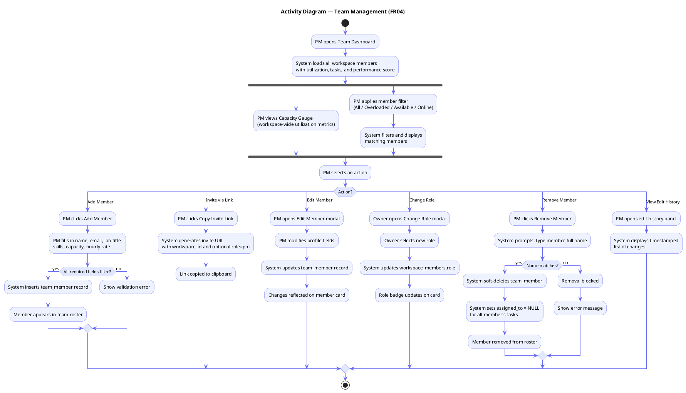

---

## FR05 — AI-Powered Resource Allocation Activity Diagram

```plantuml
@startuml AD_FR05_AIAllocation
skinparam ActivityBackgroundColor #EEF2FF
skinparam ActivityBorderColor #6366F1
skinparam ArrowColor #6366F1
skinparam ActivityDiamondBackgroundColor #E0E7FF

title Activity Diagram — AI-Powered Resource Allocation (FR05)

start

:PM opens Allocation page;
:System checks project has\ncompleted AI analysis;

if (ai_status = completed?) then (yes)
  :PM clicks Run AI Staffer;
  :System fetches project milestones\nand required skills;
  :System fetches all team members\n(skills, capacity, performance_score);
  :System fetches worker_patterns\n(blockers, conflicts, cautions);

  :AI Engine processes data;

  fork
    :Check BLOCKER patterns\nfor each member-task pair;
  fork again
    :Check GROUP CONFLICT patterns\nbetween member pairs;
  fork again
    :Check skill match\nfor each milestone;
  fork again
    :Check weekly capacity\nfor each member;
  end fork

  :AI generates assignments\n(1-5 members per milestone);

  loop For each milestone
    if (Member has BLOCKER for this task?) then (yes)
      :Exclude member from assignment;
    else (no)
      if (Member has CAUTION for this task?) then (yes)
        :Assign member with\nCAUTION warning in reasoning;
      else (no)
        :Assign member normally;
      endif
    endif
    if (Two members have GROUP CONFLICT?) then (yes)
      :Exclude one conflicting member;
    endif
  end loop

  :System saves assignments\nto project_assignments table;
  :System updates milestone\nassigned_member_ids;
  :Display assignments with\nweek, task, resource, reasoning;

  :PM reviews assignments;

  switch (PM action?)
  case (Re-run)
    :Delete previous assignments;
    :Repeat AI allocation process;
  case (Use Assignment Explainer)
    :PM types natural-language question;
    :AI returns explanation citing\nskills, patterns, capacity;
  case (Save Scenario)
    :System saves current allocation\nas named scenario;
  case (Apply Scenario)
    :System sets selected scenario\nas active allocation;
  case (Accept)
    :Allocation confirmed;
  endswitch

else (no)
  :Show error:\nProject AI analysis not complete;
endif

stop
@enduml
```

---

## FR06 — Worker Behavioural Pattern System Activity Diagram

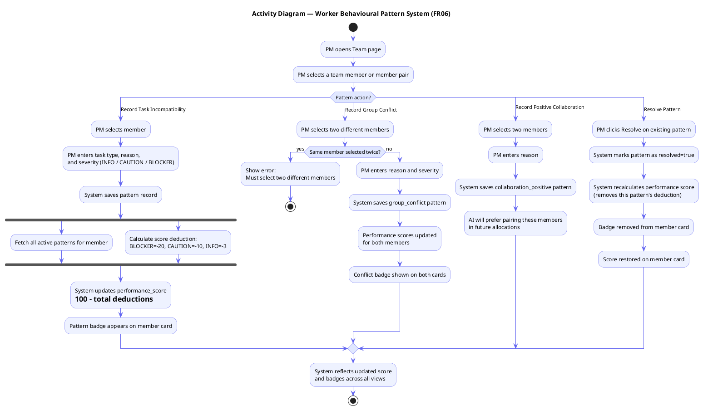

---

## FR07 — Live Roadmap Activity Diagram

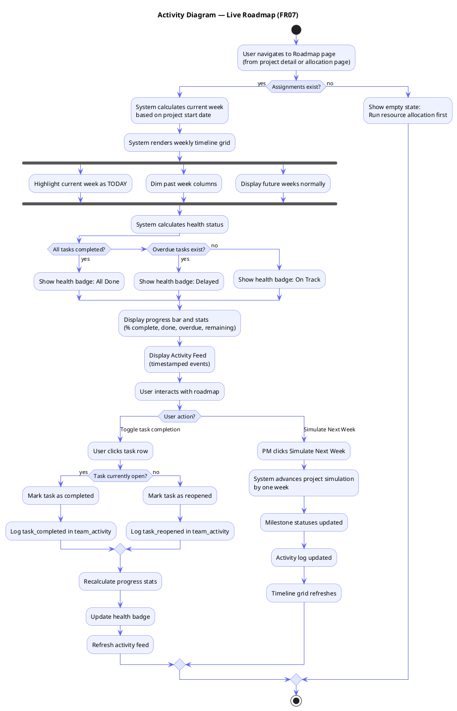

---

## FR08 — Financial Analytics Activity Diagram

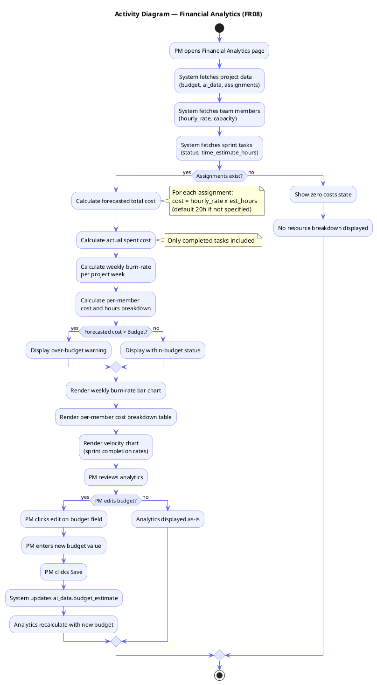

---

## FR09 — Settings & Profile Activity Diagram

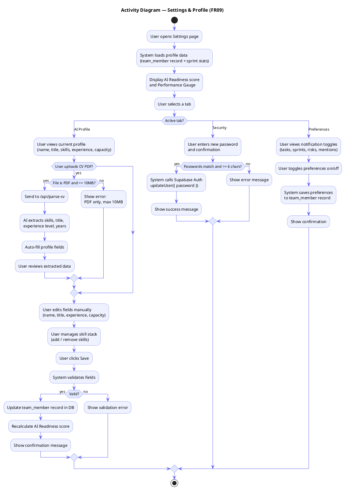

---

## FR11 — Gantt Chart Activity Diagram

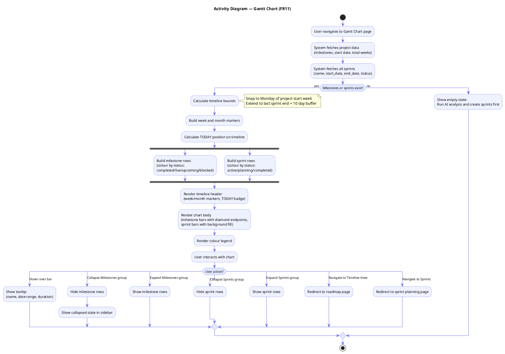

---

## FR12 — AI Risk Radar Activity Diagram

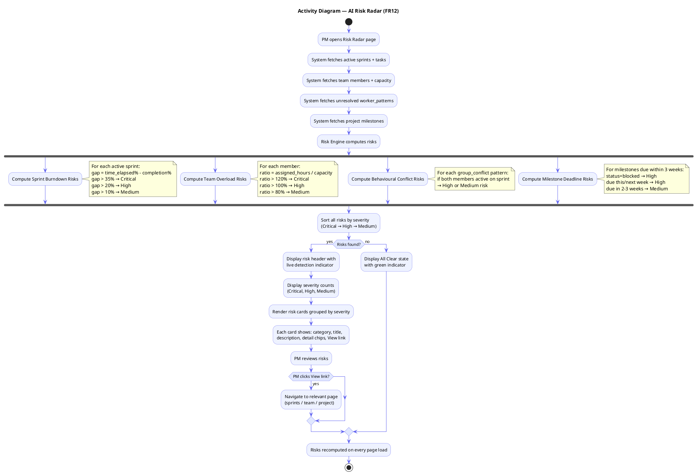

---

## FR14 — Notifications Activity Diagram

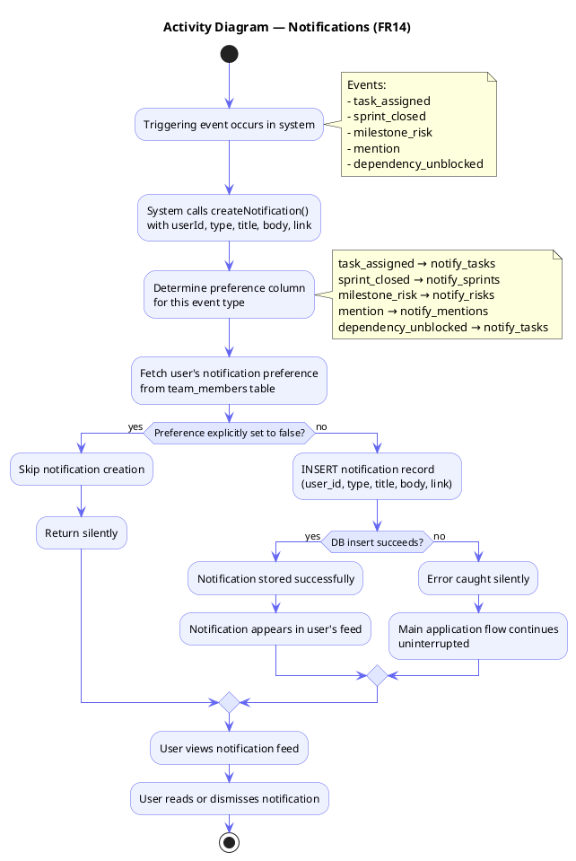

---

## FR15 — My Work Activity Diagram

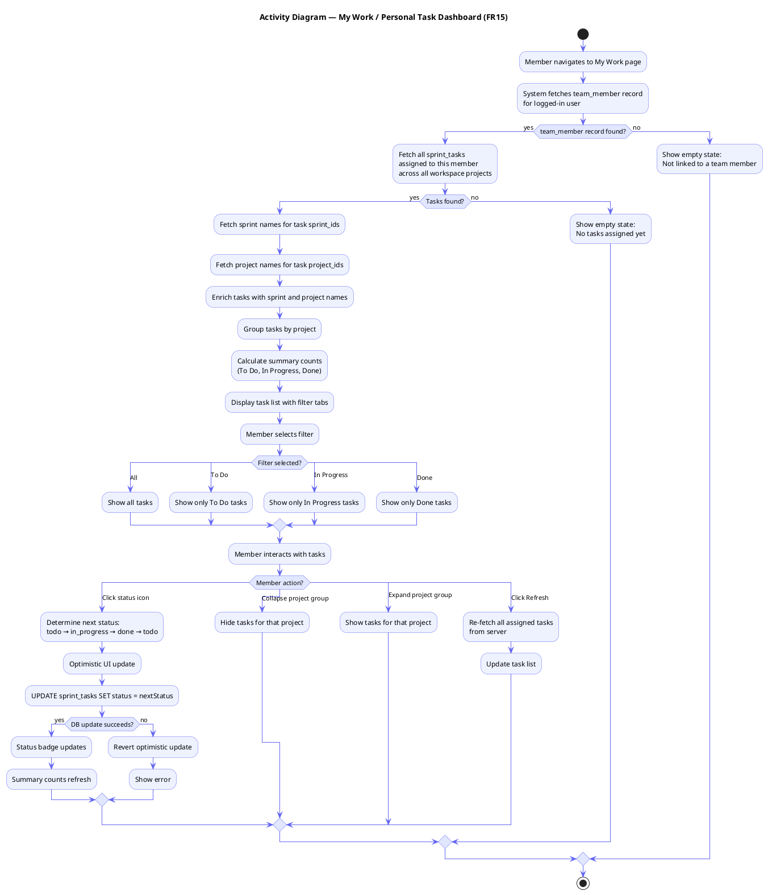

---

## FR16 — Client View Activity Diagram

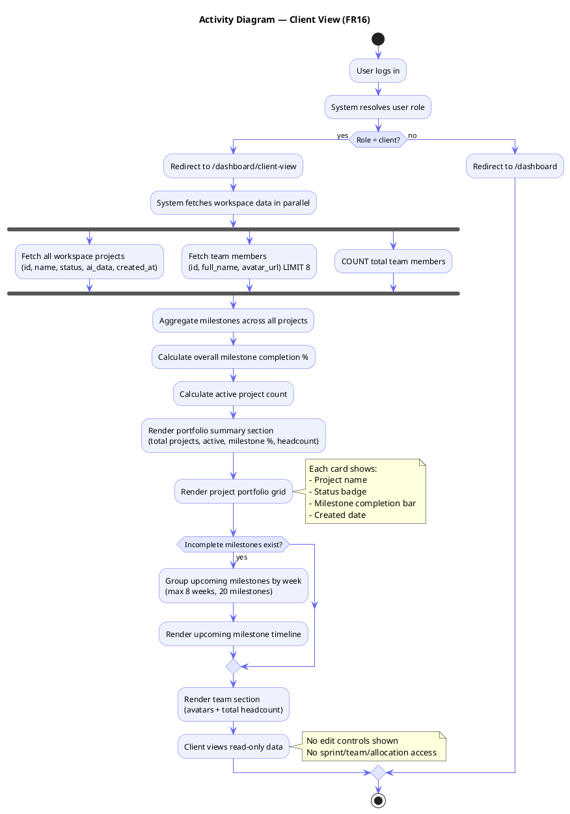

---

## FR17 — Role-Based Access Control Activity Diagram

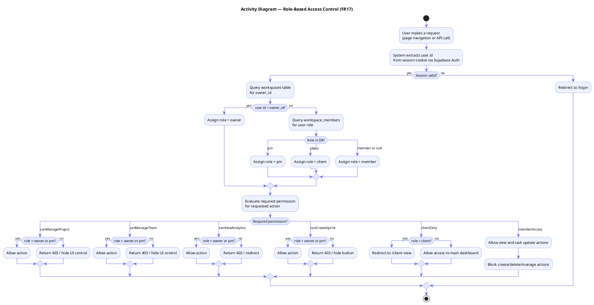

---

## FR18 — AI Project Intelligence (Insights) Activity Diagram

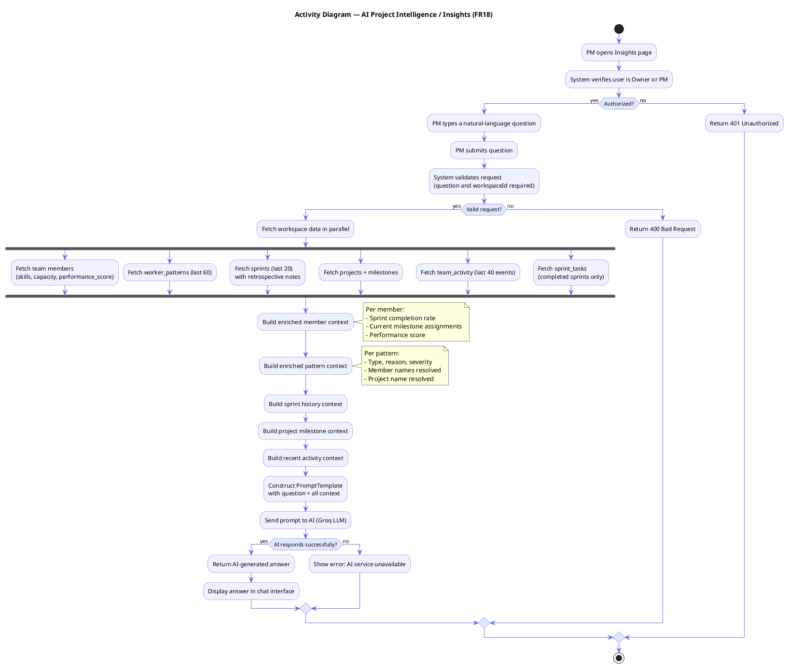
