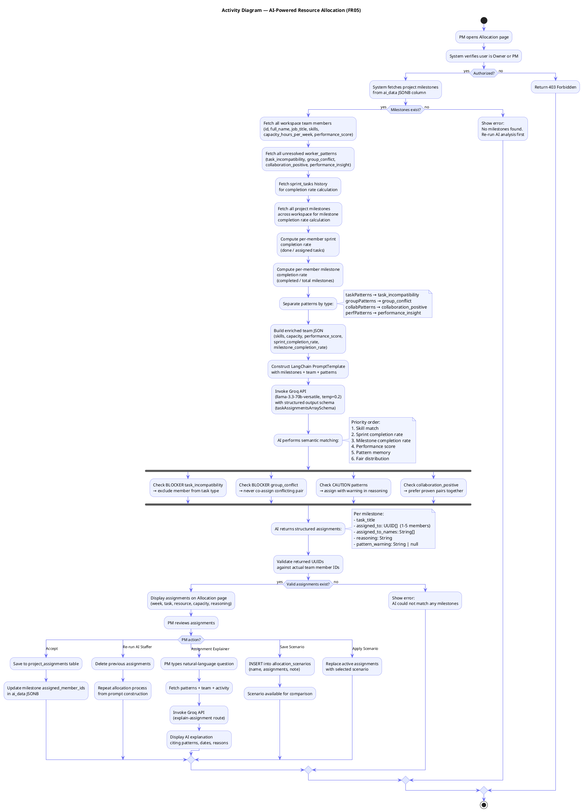
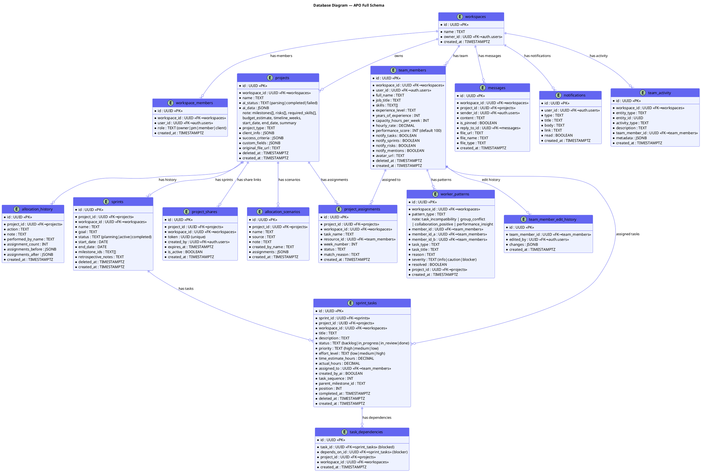

# APO — Missing Diagrams
# Paste each block individually into https://www.plantuml.com/plantuml/uml/

---

## 1. Activity Diagram — FR05: AI-Powered Resource Allocation

---

## 2. Class Diagram — AI Engine (Core Intelligence)

```plantuml
@startuml CD_AIEngine
skinparam ClassBackgroundColor #EEF2FF
skinparam ClassBorderColor #6366F1
skinparam ArrowColor #6366F1
skinparam ClassHeaderBackgroundColor #6366F1
skinparam ClassHeaderFontColor #FFFFFF
skinparam NoteBackgroundColor #F0F4FF
skinparam NoteBorderColor #6366F1

title Class Diagram — AI Engine (Core Intelligence)

package "AI Utility Layer" {
  class GroqModelFactory {
    +getGroqModel(temperature: Float, model: String): ChatGroq
    --
    model: "llama-3.3-70b-versatile"
    apiKey: process.env.GROQ_API_KEY
  }

  class ChatGroq {
    +apiKey: String
    +model: String
    +temperature: Float
    +invoke(messages): AIMessage
    +withStructuredOutput(schema: ZodSchema): StructuredModel
    +pipe(parser): Chain
  }
}

package "Schema Definitions (Zod)" {
  class ProjectDocumentSchema {
    +summary: String
    +project_type: Enum
    +budget_estimate: Float | null
    +currency: String | null
    +timeline_weeks: Int | null
    +start_date: String | null
    +end_date: String | null
    +client_info: ClientInfoSchema
    +requirements: String[] (max 8)
    +milestones: MilestoneSchema[] (max 8)
    +risks: RiskSchema[] (max 6)
    +required_skills: String[] (max 10)
    +success_criteria: String[] (max 6)
    +constraints: String[] (max 5)
    +assumptions: String[] (max 5)
  }

  class MilestoneSchema {
    +title: String
    +week: Int
    +deliverable: String
    +success_criteria: String | null
  }

  class RiskSchema {
    +description: String
    +severity: Enum(high|medium|low)
    +mitigation: String
  }

  class TaskAssignmentSchema {
    +task_title: String
    +assigned_to: UUID[] (1-5)
    +assigned_to_names: String[]
    +reasoning: String
    +pattern_warning: String | null
  }

  class CVSchema {
    +skills: String[]
    +job_title: String
    +experience_level: Enum
    +years_of_experience: Int
    +summary: String
  }

  class AISprintTaskSchema {
    +title: String
    +description: String
    +effort_level: Enum(low|medium|high)
    +time_estimate_hours: Int
    +priority: Enum(high|medium|low)
    +task_sequence: Int
    +assigned_member_id: UUID
  }

  class SmartAllocationSchema {
    +task_name: String
    +week_number: Int
    +worker_ids: UUID[] (1-5)
    +reasoning: String
    +dependency_risk_warning: String?
  }
}

package "AI API Routes" {
  class ProcessDocumentRoute {
    +POST(request): NextResponse
    --
    -extractJson(text: String): String
    -loadPDF(url: String): String
    -retryOnRateLimit(maxRetries: Int): void
    --
    Uses: GroqModelFactory (temp=0.1)
    Schema: ProjectDocumentSchema
    Stores: projects.ai_data (JSONB)
    Updates: ai_status → completed | failed
  }

  class AssignTasksRoute {
    +POST(request): NextResponse
    --
    -computeSprintStats(tasks): Record
    -computeMilestoneStats(projects): Record
    -buildEnrichedTeamJSON(): String
    -separatePatternsByType(): Object
    --
    Uses: GroqModelFactory (temp=0.2)
    Schema: taskAssignmentsArraySchema
    Stores: project_assignments
    Updates: milestone.assigned_member_ids
  }

  class ParseCVRoute {
    +POST(request): NextResponse
    --
    Uses: GroqModelFactory (temp=0.1)
    Schema: CVSchema
    Input: PDF FormData (max 20000 chars)
    Returns: skills, job_title, experience
  }

  class AISprintPopulateRoute {
    +POST(request): NextResponse
    --
    -inferPhaseFromSprintName(name, count): Phase
    -filterToMilestoneTeam(): TeamMember[]
    -buildPatternsText(): String
    --
    Uses: GroqModelFactory (temp=0.4)
    Schema: AISprintTasksSchema
    Stores: sprint_tasks (created_by_ai=true)
    Phase: Foundation | Core Dev | Integration
  }

  class InsightsRoute {
    +POST(request): NextResponse
    --
    Uses: GroqModelFactory (temp=0.35)
    Parser: StringOutputParser
    Context: members + patterns + sprints\n+ projects + activity
    Returns: Natural language answer
  }

  class ExplainAssignmentRoute {
    +POST(request): NextResponse
    --
    Uses: GroqModelFactory (temp=0.3)
    Parser: StringOutputParser
    Context: patterns + members + activity
    Returns: Assignment explanation
  }

  class ElaborateRoute {
    +POST(request): NextResponse
    --
    Uses: GroqModelFactory (temp=0.4)
    Parser: StringOutputParser
    Returns: 4-5 sentence elaboration
  }
}

package "LangChain Orchestration" {
  class PromptTemplate {
    +fromTemplate(template: String): PromptTemplate
    +invoke(variables: Object): FormattedPrompt
  }

  class StringOutputParser {
    +parse(output: AIMessage): String
  }

  class PDFLoader {
    +load(): Document[]
    --
    parsedItemSeparator: " "
    Source: Blob | File
  }
}

GroqModelFactory --> ChatGroq : creates
ProcessDocumentRoute --> GroqModelFactory : uses
ProcessDocumentRoute --> PDFLoader : uses
ProcessDocumentRoute --> ProjectDocumentSchema : validates with
AssignTasksRoute --> GroqModelFactory : uses
AssignTasksRoute --> TaskAssignmentSchema : validates with
ParseCVRoute --> GroqModelFactory : uses
ParseCVRoute --> CVSchema : validates with
ParseCVRoute --> PDFLoader : uses
AISprintPopulateRoute --> GroqModelFactory : uses
AISprintPopulateRoute --> AISprintTaskSchema : validates with
InsightsRoute --> GroqModelFactory : uses
InsightsRoute --> PromptTemplate : uses
InsightsRoute --> StringOutputParser : uses
ExplainAssignmentRoute --> GroqModelFactory : uses
ExplainAssignmentRoute --> PromptTemplate : uses
ElaborateRoute --> GroqModelFactory : uses
ElaborateRoute --> PromptTemplate : uses
ProjectDocumentSchema --> MilestoneSchema : contains
ProjectDocumentSchema --> RiskSchema : contains
@enduml
```

---

## 3. Database Diagram — Full Database Schema

---

## 4. Collaboration Diagram — Document Parsing & Requirement Extraction

```plantuml
@startuml COD_DocumentParsing
skinparam ObjectBackgroundColor #EEF2FF
skinparam ObjectBorderColor #6366F1
skinparam ArrowColor #6366F1
skinparam NoteBackgroundColor #F0F4FF
skinparam NoteBorderColor #6366F1

title Collaboration Diagram — Document Parsing & Requirement Extraction

object "PM (Browser)" as pm
object "New Project Page\n(Next.js Client)" as ui
object "Supabase Storage\n(Private Bucket)" as storage
object "projects table\n(Supabase DB)" as db_proj
object "Process Document API\n/api/process-document" as api
object "PDFLoader\n(LangChain Community)" as pdf
object "GroqModelFactory\n(llama-3.3-70b, temp=0.1)" as groq
object "projectDocumentSchema\n(Zod Validator)" as zod
object "projects table\n(UPDATE)" as db_update

pm -> ui : 1: Upload PDF file\n+ submit project form
ui -> storage : 2: Upload PDF to\nprivate Supabase bucket
storage --> ui : 3: Return signed file URL
ui -> db_proj : 4: INSERT project record\n(ai_status = 'parsing')
db_proj --> ui : 5: Return new project ID
ui -> api : 6: POST { projectId }
api -> db_proj : 7: Fetch project record\n(original_file_url, workspace_id)
db_proj --> api : 8: Project data
api -> storage : 9: fetch(original_file_url)\nDownload PDF as ArrayBuffer
storage --> api : 10: PDF binary data
api -> pdf : 11: new PDFLoader(blob)\n.load()
pdf --> api : 12: Document[]\n(pageContent joined, up to 8000 chars)
api -> groq : 13: invoke([\n  HumanMessage(systemPrompt\n  + documentText)\n])\nwith retry on rate limit (max 2)
groq --> api : 14: Raw AI response text\n(JSON string, may have markdown)
api -> api : 15: extractJson(rawText)\nStrip ```json fences\nFind first { to last }
api -> zod : 16: projectDocumentSchema\n.parse(parsedJSON)\nEnforce array limits:\nmilestones≤8, risks≤6,\nskills≤10, etc.
zod --> api : 17: Validated aiData object
api -> db_update : 18: UPDATE projects SET\nai_data = coreAiData (JSONB)\nai_status = 'completed'\nproject_type = ...\nclient_info = ...\nsuccess_criteria = ...\ncustom_fields = ...
db_update --> api : 19: Update confirmed
api --> ui : 20: { success: true, data: aiData }
ui --> pm : 21: Redirect to project detail page\n(milestones, budget, risks visible)

note bottom of groq
  Extracted fields:
  summary, project_type, budget_estimate,
  currency, timeline_weeks, start_date,
  end_date, client_info, requirements[],
  milestones[], risks[], required_skills[],
  success_criteria[], constraints[],
  assumptions[]
end note

note bottom of api
  On any error:
  UPDATE projects SET ai_status = 'failed'
  Return 500 with error message
end note
@enduml
```

