# APO — PlantUML Diagrams
# Paste each block into https://www.plantuml.com/plantuml/uml/

---

## FR01 / UCD-01 — User Management & Authentication

### UCD01-D1: Use Case Diagram

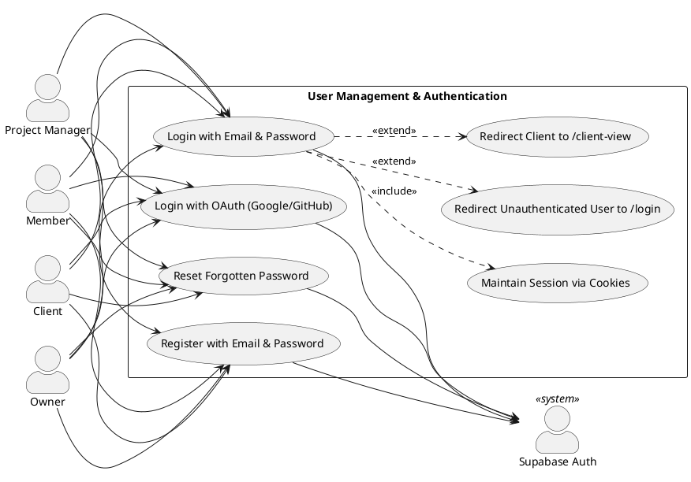

---

### UCD01-D2: Sequence Diagram — Email/Password Login

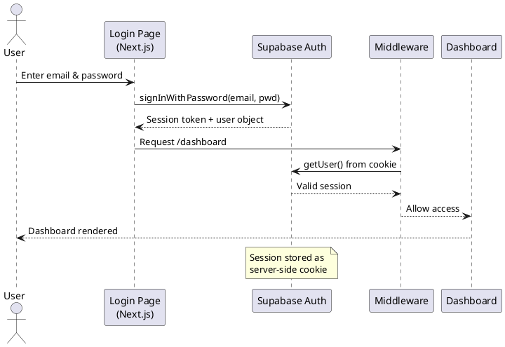

---

### UCD01-D3: Sequence Diagram — OAuth Login

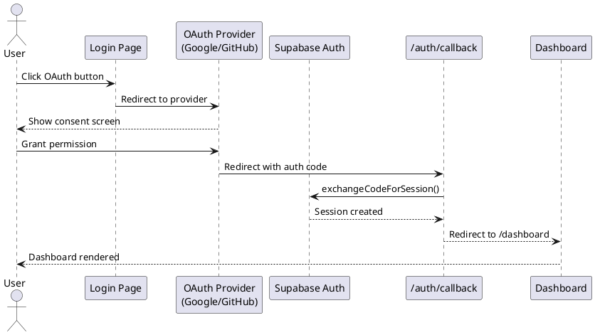

---

### UCD01-D4: Activity Diagram — Authentication Flow

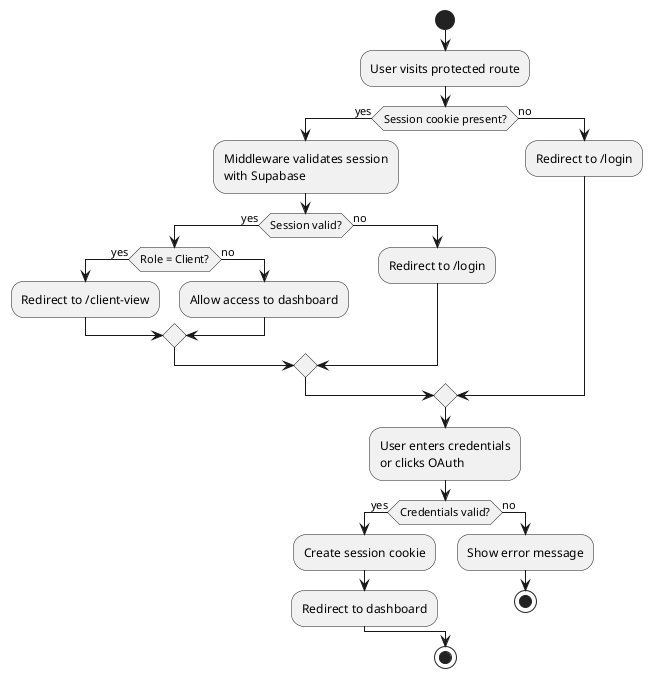

---

## FR02 / UCD-02 — Workspace & Onboarding

### UCD02-D1: Use Case Diagram

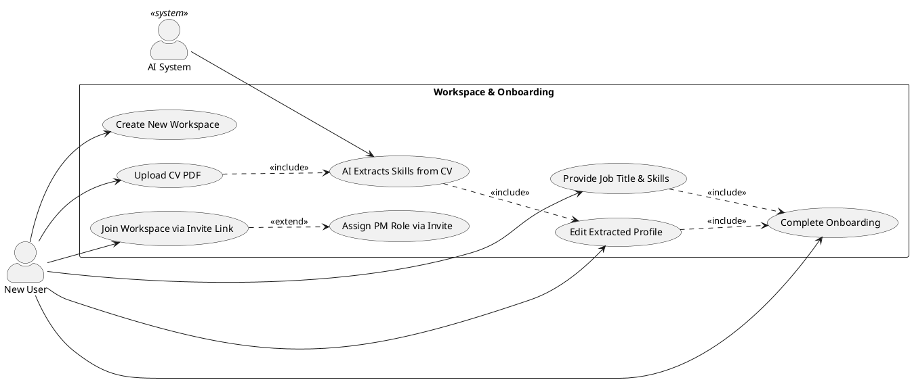

---

### UCD02-D2: Sequence Diagram — Onboarding Flow

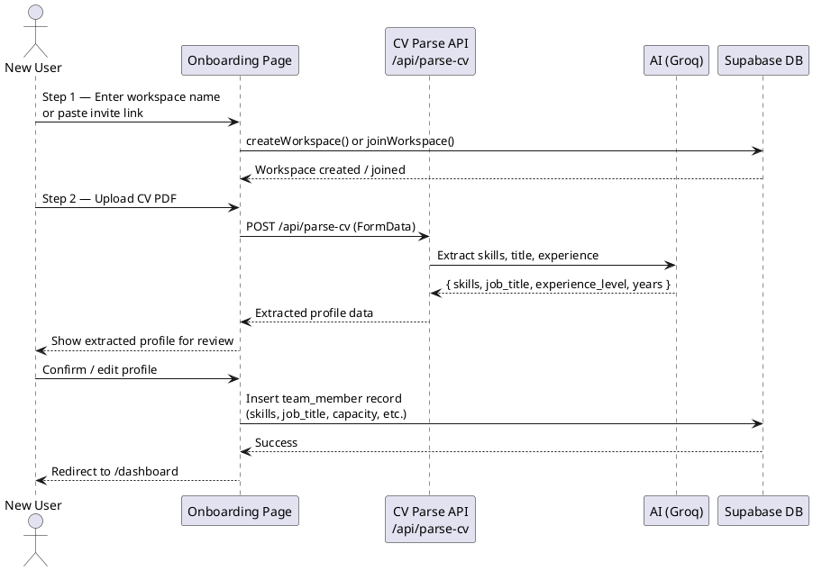

---

### UCD02-D3: Activity Diagram — Onboarding Wizard

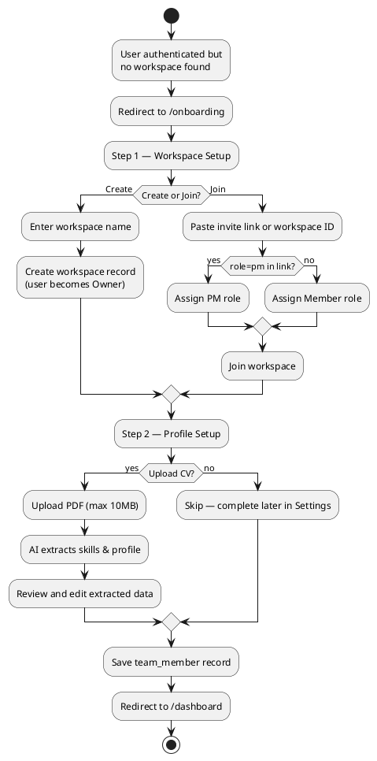

---

## FR03 / UCD-03 — Project Management

### UCD03-D1: Use Case Diagram

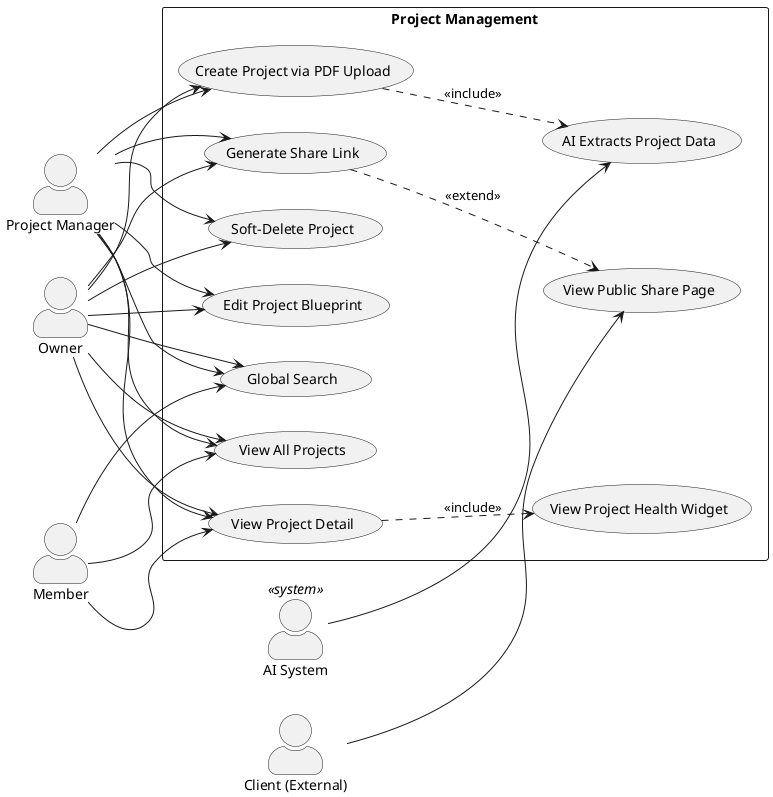

---

### UCD03-D2: Sequence Diagram — Project Creation & AI Analysis

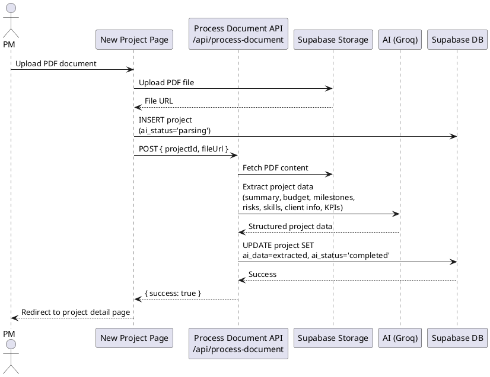

---

### UCD03-D3: Sequence Diagram — Blueprint Editor

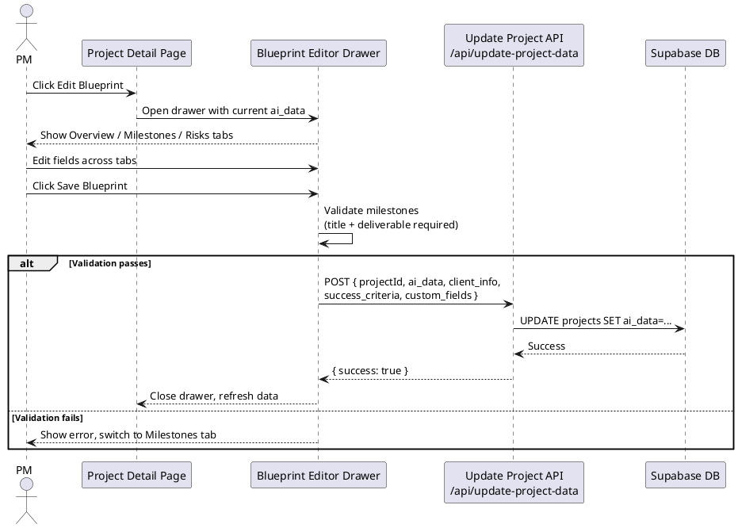

---

### UCD03-D4: Activity Diagram — Share Link Flow

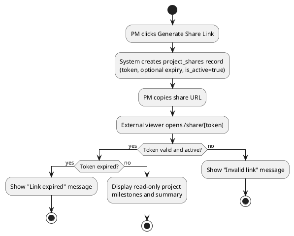

---

## FR04 / UCD-04 — Team Management

### UCD04-D1: Use Case Diagram

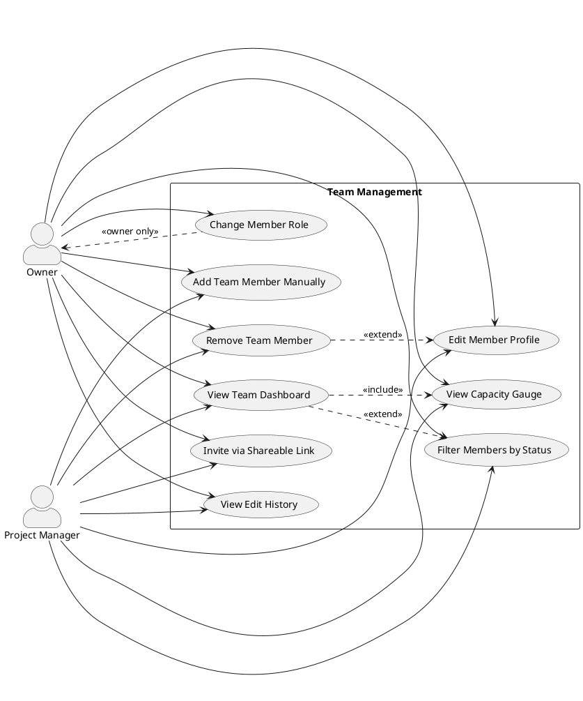

---

### UCD04-D2: Sequence Diagram — Add & Remove Member

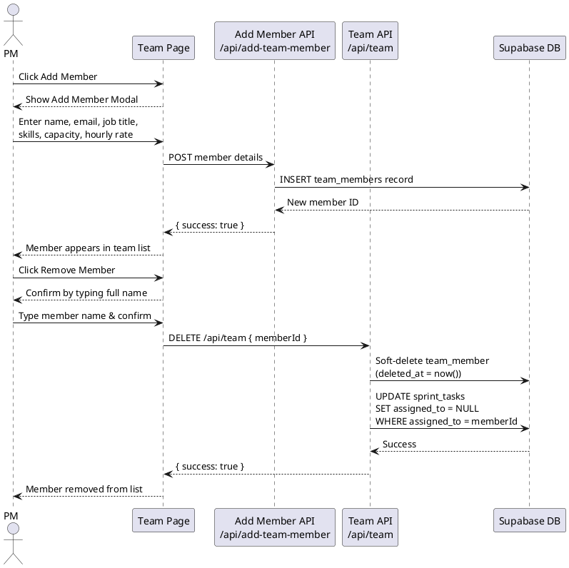

---

### UCD04-D3: Class Diagram — Team Management

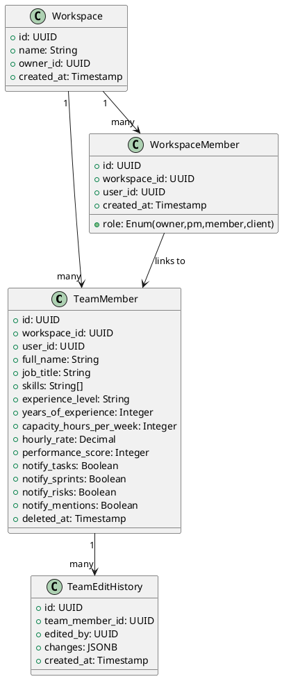

---

## FR05 / UCD-05 — AI-Powered Resource Allocation

### UCD05-D1: Use Case Diagram

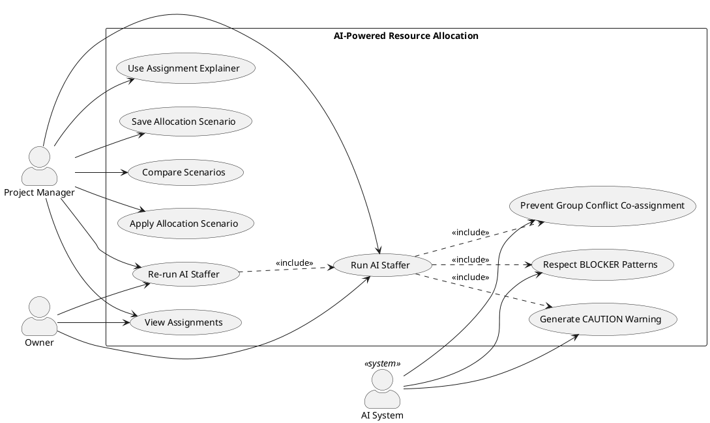

---

### UCD05-D2: Sequence Diagram — AI Allocation

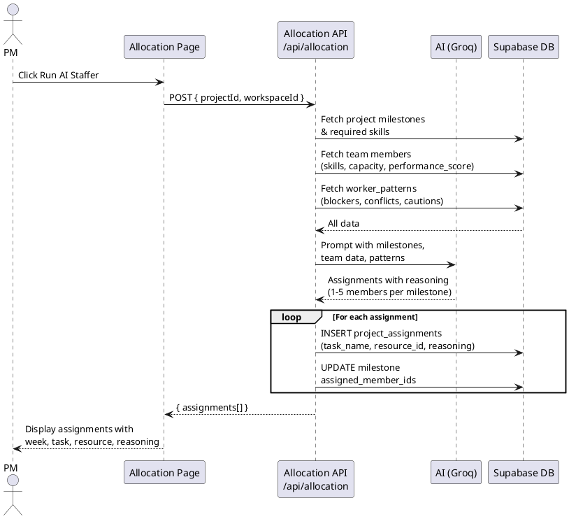

---

### UCD05-D3: Collaboration Diagram — AI Allocation

```plantuml
@startuml UCD05_Collaboration
object "PM" as pm
object "Allocation Page" as ui
object "Allocation API" as api
object "AI Engine (Groq)" as ai
object "project_assignments\ntable" as pa
object "team_members\ntable" as tm
object "worker_patterns\ntable" as wp
object "projects\ntable" as proj

pm -> ui : 1: Click Run AI Staffer
ui -> api : 2: POST { projectId }
api -> proj : 3: Fetch milestones
api -> tm : 4: Fetch team skills & capacity
api -> wp : 5: Fetch patterns (blockers/conflicts)
api -> ai : 6: Send prompt with all context
ai -> api : 7: Return assignments + reasoning
api -> pa : 8: INSERT assignments
api -> proj : 9: UPDATE assigned_member_ids
api -> ui : 10: Return assignments[]
ui -> pm : 11: Display results
@enduml
```

---

## FR06 / UCD-06 — Worker Behavioural Pattern System

### UCD06-D1: Use Case Diagram

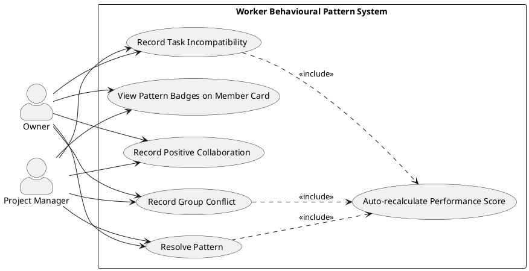

---

### UCD06-D2: Sequence Diagram — Record Pattern & Score Update

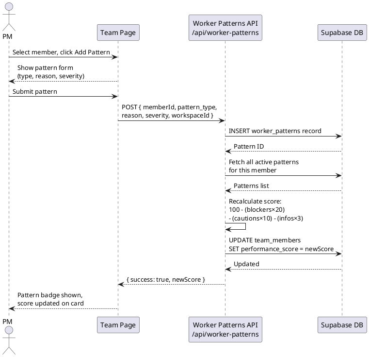

---

### UCD06-D3: Class Diagram — Pattern System

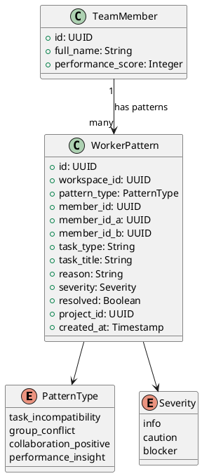

---

## FR07 / UCD-07 — Live Roadmap

### UCD07-D1: Use Case Diagram

```plantuml
@startuml UCD07_UseCase
left to right direction
skinparam actorStyle awesome

actor "Owner" as owner
actor "Project Manager" as pm
actor "Member" as member

rectangle "Live Roadmap" {
  usecase "View Weekly Timeline Grid" as UC1
  usecase "Toggle Task Completion" as UC2
  usecase "View Health Status Badge" as UC3
  usecase "View Progress Stats" as UC4
  usecase "View Activity Feed" as UC5
  usecase "Simulate Next Week" as UC6
  usecase "Navigate from Project Detail" as UC7
  usecase "Navigate from Allocation Page" as UC8
}

owner --> UC1
owner --> UC2
owner --> UC3
owner --> UC4
owner --> UC5
owner --> UC6
pm --> UC1
pm --> UC2
pm --> UC3
pm --> UC4
pm --> UC5
pm --> UC6
member --> UC1
member --> UC2
member --> UC3
member --> UC4
member --> UC5
UC1 ..> UC3 : <<include>>
UC1 ..> UC4 : <<include>>
UC1 ..> UC5 : <<include>>
UC7 ..> UC1 : <<include>>
UC8 ..> UC1 : <<include>>
@enduml
```

---

### UCD07-D2: Sequence Diagram — Toggle Task Completion

```plantuml
@startuml UCD07_Sequence
actor "User" as user
participant "Roadmap Page" as UI
participant "Roadmap Actions\n(Server Action)" as SA
participant "Supabase DB" as DB

user -> UI : Click task row to toggle
UI -> SA : toggleTaskCompletion(assignmentId)
SA -> DB : UPDATE project_assignments\nSET status = (completed/reopened)
DB --> SA : Updated
SA -> DB : INSERT team_activity\n(task_completed / task_reopened)
DB --> SA : Activity logged
SA --> UI : Revalidate path
UI --> user : Task row updates,\nactivity feed refreshes,\nhealth badge recalculates
@enduml
```

---

## FR08 / UCD-08 — Financial Analytics

### UCD08-D1: Use Case Diagram

```plantuml
@startuml UCD08_UseCase
left to right direction
skinparam actorStyle awesome

actor "Owner" as owner
actor "Project Manager" as pm

rectangle "Financial Analytics" {
  usecase "View Budget vs Forecast vs Actual" as UC1
  usecase "View Over-Budget Warning" as UC2
  usecase "View Weekly Burn-Rate Chart" as UC3
  usecase "View Per-Member Cost Breakdown" as UC4
  usecase "Edit AI-Estimated Budget" as UC5
  usecase "View Velocity Chart" as UC6
}

owner --> UC1
owner --> UC2
owner --> UC3
owner --> UC4
owner --> UC5
owner --> UC6
pm --> UC1
pm --> UC2
pm --> UC3
pm --> UC4
pm --> UC5
pm --> UC6
UC1 ..> UC2 : <<extend>>
UC1 ..> UC3 : <<include>>
UC1 ..> UC4 : <<include>>
@enduml
```

---

### UCD08-D2: Sequence Diagram — Analytics Calculation

```plantuml
@startuml UCD08_Sequence
actor "PM" as pm
participant "Analytics Page" as UI
participant "Analytics Actions" as SA
participant "Supabase DB" as DB

pm -> UI : Open Analytics page
UI -> SA : fetchAnalyticsData(projectId)
SA -> DB : Fetch project (budget, ai_data)
SA -> DB : Fetch project_assignments\n(resource_id, task_name, week)
SA -> DB : Fetch team_members\n(hourly_rate, capacity)
SA -> DB : Fetch sprint_tasks\n(status, time_estimate_hours)
DB --> SA : All data

SA -> SA : Calculate:\nforecast = sum(hourly_rate × est_hours)\nactual = sum(completed tasks only)\nburn_rate per week
SA --> UI : { budget, forecast, actual,\nweekly_burn[], member_costs[] }
UI --> pm : Render charts and tables

pm -> UI : Edit budget inline
UI -> SA : updateBudget(projectId, newBudget)
SA -> DB : UPDATE projects SET\nai_data.budget_estimate = newBudget
DB --> SA : Success
SA --> UI : Budget updated
@enduml
```

---

## FR09 / UCD-09 — Settings & Profile

### UCD09-D1: Use Case Diagram

```plantuml
@startuml UCD09_UseCase
left to right direction
skinparam actorStyle awesome

actor "User" as user
actor "AI System" as ai <<system>>

rectangle "Settings & Profile" {
  usecase "Update AI Profile\n(name, title, skills, capacity)" as UC1
  usecase "Upload CV to Extract Skills" as UC2
  usecase "AI Parses CV" as UC3
  usecase "Change Password" as UC4
  usecase "Configure Notification Preferences" as UC5
  usecase "View AI Readiness Score" as UC6
  usecase "View Performance Gauge" as UC7
  usecase "View Sprint & Milestone Rates" as UC8
}

user --> UC1
user --> UC2
user --> UC4
user --> UC5
user --> UC6
user --> UC7
user --> UC8
ai --> UC3
UC2 ..> UC3 : <<include>>
UC3 ..> UC1 : <<extend>>
UC1 ..> UC6 : <<include>>
@enduml
```

---

### UCD09-D2: Sequence Diagram — Profile Update & CV Scan

```plantuml
@startuml UCD09_Sequence
actor "User" as user
participant "Settings Page" as UI
participant "Settings Profile API\n/api/settings/profile" as API
participant "CV Parse API\n/api/parse-cv" as CVAPI
participant "AI (Groq)" as AI
participant "Supabase DB" as DB

user -> UI : Open Settings
UI -> API : GET /api/settings/profile
API -> DB : Fetch team_member + sprint stats
DB --> API : Profile data
API --> UI : Render profile with\nAI Readiness score & Performance Gauge

user -> UI : Upload CV PDF
UI -> CVAPI : POST /api/parse-cv (FormData)
CVAPI -> AI : Extract skills, title, experience
AI --> CVAPI : Extracted data
CVAPI --> UI : Auto-fill profile fields

user -> UI : Edit fields & Save
UI -> API : POST /api/settings/profile\n{ full_name, skills, job_title,\nexperience_level, capacity,\nnotify_* preferences }
API -> DB : UPDATE team_members
DB --> API : Success
API --> UI : { success: true }
UI --> user : Confirmation shown
@enduml
```

---

## FR10 / UCD-10 — Sprint Management

### UCD10-D1: Use Case Diagram

```plantuml
@startuml UCD10_UseCase
left to right direction
skinparam actorStyle awesome

actor "Owner" as owner
actor "Project Manager" as pm
actor "Member" as member
actor "AI System" as ai <<system>>

rectangle "Sprint Management" {
  usecase "Create Sprint" as UC1
  usecase "Start Sprint" as UC2
  usecase "Close Sprint" as UC3
  usecase "Soft-Delete Sprint" as UC4
  usecase "Restore Sprint from Trash" as UC5
  usecase "AI Populate Tasks" as UC6
  usecase "Add Task Manually" as UC7
  usecase "Move Task via Drag-and-Drop" as UC8
  usecase "Reassign Task" as UC9
  usecase "Log Actual Hours" as UC10
  usecase "Add Task Dependency" as UC11
  usecase "View Burndown Chart" as UC12
}

owner --> UC1
owner --> UC2
owner --> UC3
owner --> UC4
owner --> UC5
owner --> UC6
owner --> UC7
pm --> UC1
pm --> UC2
pm --> UC3
pm --> UC4
pm --> UC5
pm --> UC6
pm --> UC7
member --> UC7
member --> UC8
member --> UC9
member --> UC10
member --> UC11
member --> UC12
ai --> UC6
UC1 ..> UC2 : <<extend>>
UC8 ..> UC11 : <<extend>>
UC6 ..> UC7 : <<include>>
@enduml
```

---

### UCD10-D2: Sequence Diagram — Sprint Creation

```plantuml
@startuml UCD10_Sequence_Create
actor "PM" as pm
participant "Sprint Planning Page" as UI
participant "Sprint Create API\n/api/sprints/create" as API
participant "Supabase DB" as DB

pm -> UI : Click New Sprint
UI --> pm : Show sprint creation modal
pm -> UI : Enter name, goal, dates,\noptional milestone link
UI -> API : POST { projectId, workspaceId,\nname, goal, start_date, end_date,\nmilestone_ids }
API -> DB : Check if linked milestone\nis already completed
alt Milestone completed
  API --> UI : 400 Error — milestone already done
  UI --> pm : Show error message
else Milestone available
  API -> DB : INSERT sprints\n(status='planning')
  DB --> API : New sprint record
  API --> UI : { success: true, sprint }
  UI --> pm : Sprint appears in Planning section
end
@enduml
```

---

### UCD10-D3: Sequence Diagram — Sprint Board Task Flow

```plantuml
@startuml UCD10_Sequence_Board
actor "Member" as member
participant "Sprint Board" as UI
participant "Task Status API\n/api/sprints/task-status" as API
participant "Dependencies API\n/api/sprints/dependencies" as DepAPI
participant "Supabase DB" as DB

member -> UI : Drag task to "In Progress"
UI -> DepAPI : Check blockers for task
DepAPI -> DB : Fetch unfinished dependencies
DB --> DepAPI : Blocker list
alt Has unmet blockers
  DepAPI --> UI : Blockers found
  UI --> member : Toast: "Blocked by: [task name]"\nMove rejected
else No blockers
  UI -> API : POST { taskId, status='in_progress' }
  API -> DB : UPDATE sprint_tasks\nSET status='in_progress'
  DB --> API : Success
  API --> UI : { success: true }
  UI --> member : Task moves to In Progress column
end
@enduml
```

---

### UCD10-D4: Activity Diagram — Sprint Lifecycle

```plantuml
@startuml UCD10_Activity
start
:PM creates sprint\n(status = planning);
:PM links optional milestone;
:PM adds tasks manually\nor uses AI Populate;
:PM starts sprint\n(status = active);
fork
  :Members work on tasks;
  :Drag tasks across columns;
  :Log actual hours;
fork again
  :PM monitors burndown bar;
  :PM views Risk Radar;
end fork
if (All tasks done?) then (yes)
  :PM closes sprint\n(status = completed);
  :Enter retrospective notes;
else (no)
  :PM closes sprint\nwith incomplete tasks;
  :Incomplete tasks remain\nin backlog;
endif
:Sprint marked completed;
stop
@enduml
```

---

## FR11 / UCD-11 — Gantt Chart

### UCD11-D1: Use Case Diagram

```plantuml
@startuml UCD11_UseCase
left to right direction
skinparam actorStyle awesome

actor "Owner" as owner
actor "Project Manager" as pm
actor "Member" as member

rectangle "Gantt Chart" {
  usecase "View Milestone Bars" as UC1
  usecase "View Sprint Bars" as UC2
  usecase "View Today Marker" as UC3
  usecase "Hover for Tooltip" as UC4
  usecase "Collapse Milestone Group" as UC5
  usecase "Collapse Sprint Group" as UC6
  usecase "View Colour Legend" as UC7
  usecase "Navigate to Timeline View" as UC8
  usecase "Navigate to Sprints" as UC9
}

owner --> UC1
owner --> UC2
owner --> UC3
owner --> UC4
owner --> UC5
owner --> UC6
owner --> UC7
pm --> UC1
pm --> UC2
pm --> UC3
pm --> UC4
pm --> UC5
pm --> UC6
pm --> UC7
member --> UC1
member --> UC2
member --> UC3
member --> UC4
UC1 ..> UC4 : <<extend>>
UC2 ..> UC4 : <<extend>>
UC1 ..> UC5 : <<extend>>
UC2 ..> UC6 : <<extend>>
@enduml
```

---

### UCD11-D2: Sequence Diagram — Gantt Chart Render

```plantuml
@startuml UCD11_Sequence
actor "User" as user
participant "Gantt Page\n(Server Component)" as UI
participant "Supabase DB" as DB

user -> UI : Navigate to /gantt
UI -> DB : Fetch project\n(name, ai_data, created_at)
UI -> DB : Fetch sprints\n(name, start_date, end_date, status)
DB --> UI : Project + sprints data

UI -> UI : Calculate timeline bounds\n(snap to Monday, +10 day buffer)
UI -> UI : Build milestone rows\n(week → date range, colour by status)
UI -> UI : Build sprint rows\n(date range, colour by status)
UI -> UI : Calculate today marker position
UI --> user : Render Gantt chart with\nbars, markers, legend, tooltips
@enduml
```

---

## FR12 / UCD-12 — AI Risk Radar

### UCD12-D1: Use Case Diagram

```plantuml
@startuml UCD12_UseCase
left to right direction
skinparam actorStyle awesome

actor "Owner" as owner
actor "Project Manager" as pm

rectangle "AI Risk Radar" {
  usecase "View Sprint Burndown Risks" as UC1
  usecase "View Team Overload Risks" as UC2
  usecase "View Behavioural Conflict Risks" as UC3
  usecase "View Milestone Deadline Risks" as UC4
  usecase "Navigate to Risk Source" as UC5
  usecase "View All Clear State" as UC6
  usecase "View Risk Severity Counts" as UC7
}

owner --> UC1
owner --> UC2
owner --> UC3
owner --> UC4
owner --> UC5
owner --> UC6
owner --> UC7
pm --> UC1
pm --> UC2
pm --> UC3
pm --> UC4
pm --> UC5
pm --> UC6
pm --> UC7
UC1 ..> UC7 : <<include>>
UC2 ..> UC7 : <<include>>
UC3 ..> UC7 : <<include>>
UC4 ..> UC7 : <<include>>
UC1 ..> UC5 : <<extend>>
UC2 ..> UC5 : <<extend>>
@enduml
```

---

### UCD12-D2: Sequence Diagram — Risk Computation

```plantuml
@startuml UCD12_Sequence
actor "PM" as pm
participant "Risk Radar Page\n(Server Component)" as UI
participant "Supabase DB" as DB
participant "Risk Engine\n(Server-side logic)" as RE

pm -> UI : Open Risk Radar page
UI -> DB : Fetch active sprints + tasks
UI -> DB : Fetch team members + capacity
UI -> DB : Fetch unresolved worker_patterns
UI -> DB : Fetch project milestones
DB --> UI : All data

UI -> RE : Compute sprint burndown risks\n(time elapsed vs completion rate)
UI -> RE : Compute team overload risks\n(assigned hours vs capacity)
UI -> RE : Compute conflict risks\n(active members with group_conflict)
UI -> RE : Compute milestone deadline risks\n(weeks remaining < 3)
RE --> UI : risks[] sorted by severity

UI --> pm : Render risk cards\n(Critical → High → Medium)
@enduml
```

---

## FR13 / UCD-13 — Real-Time Messaging

### UCD13-D1: Use Case Diagram

```plantuml
@startuml UCD13_UseCase
left to right direction
skinparam actorStyle awesome

actor "Owner" as owner
actor "Project Manager" as pm
actor "Member" as member
actor "Supabase Realtime" as rt <<system>>

rectangle "Real-Time Messaging" {
  usecase "Select Channel\n(General or Project)" as UC1
  usecase "Send Message" as UC2
  usecase "Reply to Message" as UC3
  usecase "Pin / Unpin Message" as UC4
  usecase "Attach File" as UC5
  usecase "@Mention Team Member" as UC6
  usecase "Search Messages" as UC7
  usecase "Receive Real-Time Message" as UC8
  usecase "Auto-Reconnect on Error" as UC9
}

owner --> UC1
owner --> UC2
owner --> UC3
owner --> UC4
owner --> UC5
owner --> UC6
owner --> UC7
pm --> UC1
pm --> UC2
pm --> UC3
pm --> UC4
pm --> UC5
pm --> UC6
pm --> UC7
member --> UC1
member --> UC2
member --> UC3
member --> UC4
member --> UC5
member --> UC6
member --> UC7
rt --> UC8
rt --> UC9
UC2 ..> UC8 : <<include>>
UC4 ..> UC8 : <<include>>
@enduml
```

---

### UCD13-D2: Sequence Diagram — Send & Receive Message

```plantuml
@startuml UCD13_Sequence
actor "Sender" as sender
actor "Receiver" as receiver
participant "Messages Page" as UI
participant "Send API\n/api/messages/send" as SendAPI
participant "Supabase DB\n(messages table)" as DB
participant "Supabase Realtime" as RT

sender -> UI : Type message & send
UI -> SendAPI : POST { workspaceId,\ncontent, projectId? }
SendAPI -> DB : INSERT messages record
DB --> SendAPI : Message ID
SendAPI --> UI : { success: true }

DB -> RT : Postgres INSERT event\n(messages table)
RT -> UI : Broadcast to channel subscribers
UI -> UI : Enrich message\n(sender name from map)
UI --> receiver : New message appears\nin real time
@enduml
```

---

### UCD13-D3: Activity Diagram — Reconnection Flow

```plantuml
@startuml UCD13_Activity
start
:User selects channel;
:Subscribe to Supabase Realtime channel;
:Load message history;
if (Subscription status?) then (SUBSCRIBED)
  :Clear connection error banner;
  :Receive messages in real time;
else (CHANNEL_ERROR / TIMED_OUT)
  :Show connection error banner;
  :Start 3-second reconnect timer;
  :Increment reconnectKey;
  :Re-subscribe to channel;
  if (Reconnect successful?) then (yes)
    :Clear error banner;
  else (no)
    :Show Retry Now button;
    :Wait for manual retry;
  endif
endif
stop
@enduml
```

---

## FR14 / UCD-14 — Notifications

### UCD14-D1: Use Case Diagram

```plantuml
@startuml UCD14_UseCase
left to right direction
skinparam actorStyle awesome

actor "System" as sys <<system>>
actor "User" as user

rectangle "Notifications" {
  usecase "Receive Task Assigned Notification" as UC1
  usecase "Receive Sprint Closed Notification" as UC2
  usecase "Receive Milestone Risk Notification" as UC3
  usecase "Receive Mention Notification" as UC4
  usecase "Receive Dependency Unblocked Notification" as UC5
  usecase "Configure Notification Preferences" as UC6
  usecase "View Notification Feed" as UC7
}

sys --> UC1
sys --> UC2
sys --> UC3
sys --> UC4
sys --> UC5
user --> UC6
user --> UC7
UC1 ..> UC6 : <<extend>>
UC2 ..> UC6 : <<extend>>
UC3 ..> UC6 : <<extend>>
UC4 ..> UC6 : <<extend>>
UC5 ..> UC6 : <<extend>>
@enduml
```

---

### UCD14-D2: Sequence Diagram — Notification Creation

```plantuml
@startuml UCD14_Sequence
participant "Triggering Action\n(e.g. task assigned)" as trigger
participant "Notification Utility\ncreateNotification()" as util
participant "Supabase Admin DB" as DB

trigger -> util : createNotification({\n  userId, type, title, body, link\n})
util -> DB : Fetch team_member\nnotification preference\nfor this event type
DB --> util : preference value (true/false/null)
alt Preference disabled (false)
  util --> trigger : Return silently\n(no notification created)
else Preference enabled or not set
  util -> DB : INSERT notifications\n{ user_id, type, title, body, link }
  DB --> util : Notification ID
  util --> trigger : Return (non-fatal)
end

note over util : Any error is caught\nand swallowed silently
@enduml
```

---

## FR15 / UCD-15 — My Work

### UCD15-D1: Use Case Diagram

```plantuml
@startuml UCD15_UseCase
left to right direction
skinparam actorStyle awesome

actor "Member" as member
actor "Owner" as owner
actor "Project Manager" as pm

rectangle "My Work — Personal Task Dashboard" {
  usecase "View All Assigned Tasks" as UC1
  usecase "Filter Tasks by Status" as UC2
  usecase "Cycle Task Status" as UC3
  usecase "View Summary Counts" as UC4
  usecase "Collapse / Expand Project Group" as UC5
  usecase "Refresh Task List" as UC6
}

member --> UC1
member --> UC2
member --> UC3
member --> UC4
member --> UC5
member --> UC6
owner --> UC1
owner --> UC2
owner --> UC3
pm --> UC1
pm --> UC2
pm --> UC3
UC1 ..> UC4 : <<include>>
UC1 ..> UC2 : <<extend>>
UC3 ..> UC1 : <<include>>
@enduml
```

---

### UCD15-D2: Sequence Diagram — Task Status Cycle

```plantuml
@startuml UCD15_Sequence
actor "Member" as member
participant "My Work Page" as UI
participant "Supabase DB\n(client-side)" as DB

member -> UI : Click task status icon
UI -> UI : Determine next status:\ntodo → in_progress → done → todo
UI -> UI : Optimistic update\n(update local state immediately)
UI -> DB : UPDATE sprint_tasks\nSET status = nextStatus\nWHERE id = taskId
DB --> UI : Success
UI --> member : Status badge updates,\nsummary counts refresh
@enduml
```

---

## FR16 / UCD-16 — Client View

### UCD16-D1: Use Case Diagram

```plantuml
@startuml UCD16_UseCase
left to right direction
skinparam actorStyle awesome

actor "Client" as client

rectangle "Client View (Read-Only)" {
  usecase "View Portfolio Summary\n(projects, milestones, team)" as UC1
  usecase "View Project Portfolio Grid" as UC2
  usecase "View Upcoming Milestone Timeline" as UC3
  usecase "View Team Headcount" as UC4
  usecase "View Per-Project Completion %" as UC5
}

client --> UC1
client --> UC2
client --> UC3
client --> UC4
client --> UC5
UC1 ..> UC2 : <<include>>
UC1 ..> UC3 : <<include>>
UC1 ..> UC4 : <<include>>
UC2 ..> UC5 : <<include>>
@enduml
```

---

### UCD16-D2: Sequence Diagram — Client View Load

```plantuml
@startuml UCD16_Sequence
actor "Client" as client
participant "Client View Page\n(Server Component)" as UI
participant "Supabase DB" as DB

client -> UI : Navigate to /dashboard/client-view
UI -> DB : Verify user role = 'client'
alt Not client role
  UI --> client : Redirect to /dashboard
else Client role confirmed
  UI -> DB : Fetch all workspace projects\n(id, name, status, ai_data, created_at)
  UI -> DB : Fetch team_members\n(id, full_name, avatar_url) LIMIT 8
  UI -> DB : COUNT team_members (total)
  DB --> UI : All data

  UI -> UI : Aggregate milestones\nacross all projects
  UI -> UI : Calculate completion %\nper project and overall
  UI -> UI : Group upcoming milestones\nby week (max 8 weeks)
  UI --> client : Render read-only portfolio view
end
@enduml
```

---

## FR17 / UCD-17 — Role-Based Access Control

### UCD17-D1: Use Case Diagram

```plantuml
@startuml UCD17_UseCase
left to right direction
skinparam actorStyle awesome

actor "Owner" as owner
actor "Project Manager" as pm
actor "Member" as member
actor "Client" as client
actor "System" as sys <<system>>

rectangle "Role-Based Access Control" {
  usecase "Resolve User Role" as UC1
  usecase "Enforce Owner Permissions" as UC2
  usecase "Enforce PM Permissions" as UC3
  usecase "Enforce Member Permissions" as UC4
  usecase "Enforce Client Restrictions" as UC5
  usecase "Return 403 on Unauthorized API Call" as UC6
  usecase "Redirect Client to /client-view" as UC7
  usecase "Hide UI Controls for Insufficient Role" as UC8
}

sys --> UC1
owner --> UC2
pm --> UC3
member --> UC4
client --> UC5
UC1 ..> UC2 : <<extend>>
UC1 ..> UC3 : <<extend>>
UC1 ..> UC4 : <<extend>>
UC1 ..> UC5 : <<extend>>
UC3 ..> UC6 : <<extend>>
UC4 ..> UC6 : <<extend>>
UC5 ..> UC7 : <<include>>
UC3 ..> UC8 : <<include>>
UC4 ..> UC8 : <<include>>
@enduml
```

---

### UCD17-D2: Sequence Diagram — API Role Enforcement

```plantuml
@startuml UCD17_Sequence
actor "User" as user
participant "API Route\n(e.g. /api/sprints/create)" as API
participant "Supabase Auth" as Auth
participant "Supabase DB" as DB

user -> API : POST request with session cookie
API -> Auth : getUser() from cookie
Auth --> API : { user.id }
API -> DB : SELECT owner_id FROM workspaces\nWHERE id = workspaceId
DB --> API : { owner_id }
alt user.id == owner_id
  API -> API : Role = 'owner' → permitted
else
  API -> DB : SELECT role FROM workspace_members\nWHERE user_id = user.id\nAND workspace_id = workspaceId
  DB --> API : { role }
  alt role == 'pm'
    API -> API : Role = 'pm' → permitted
  else
    API --> user : 403 Forbidden
  end
end
API -> DB : Execute privileged operation
DB --> API : Success
API --> user : 200 OK
@enduml
```

---

### UCD17-D3: Class Diagram — RBAC Structure

```plantuml
@startuml UCD17_Class
enum AppRole {
  owner
  pm
  member
  client
}

class RoleChecker {
  +getUserRole(userId, workspaceId): AppRole
  +canManageProject(role): Boolean
  +canManageTeam(role): Boolean
  +canViewAnalytics(role): Boolean
  +canCreateSprint(role): Boolean
  +canDeleteSprint(role): Boolean
}

class Workspace {
  +id: UUID
  +owner_id: UUID
}

class WorkspaceMember {
  +user_id: UUID
  +workspace_id: UUID
  +role: AppRole
}

RoleChecker --> AppRole
RoleChecker --> Workspace : queries
RoleChecker --> WorkspaceMember : queries
@enduml
```

---

## FR18 / UCD-18 — AI Project Intelligence (Insights)

### UCD18-D1: Use Case Diagram

```plantuml
@startuml UCD18_UseCase
left to right direction
skinparam actorStyle awesome

actor "Owner" as owner
actor "Project Manager" as pm
actor "AI System" as ai <<system>>

rectangle "AI Project Intelligence (Insights)" {
  usecase "Ask Natural-Language Question" as UC1
  usecase "AI Analyses Team Performance" as UC2
  usecase "AI Analyses Behavioural Patterns" as UC3
  usecase "AI Analyses Sprint History" as UC4
  usecase "AI Analyses Milestone Assignments" as UC5
  usecase "Receive AI-Generated Answer" as UC6
}

owner --> UC1
owner --> UC6
pm --> UC1
pm --> UC6
ai --> UC2
ai --> UC3
ai --> UC4
ai --> UC5
UC1 ..> UC2 : <<include>>
UC1 ..> UC3 : <<include>>
UC1 ..> UC4 : <<include>>
UC1 ..> UC5 : <<include>>
UC2 ..> UC6 : <<include>>
UC3 ..> UC6 : <<include>>
UC4 ..> UC6 : <<include>>
UC5 ..> UC6 : <<include>>
@enduml
```

---

### UCD18-D2: Sequence Diagram — Insights Query

```plantuml
@startuml UCD18_Sequence
actor "PM" as pm
participant "Insights Page" as UI
participant "Insights API\n/api/insights" as API
participant "Supabase Admin DB" as DB
participant "AI (Groq)" as AI

pm -> UI : Type question and submit
UI -> API : POST { question, workspaceId }
API -> DB : Fetch team members\n(skills, capacity, performance_score)
API -> DB : Fetch worker_patterns (last 60)
API -> DB : Fetch sprints (last 20)
API -> DB : Fetch projects + milestones
API -> DB : Fetch team_activity (last 40)
API -> DB : Fetch sprint_tasks\n(completed sprints only)
DB --> API : All workspace data

API -> API : Build enriched context\n(member stats, pattern details,\nsprint history, project milestones)
API -> AI : PromptTemplate with\nquestion + full context
AI --> API : Specific, data-backed answer
API --> UI : { answer }
UI --> pm : Display AI answer
@enduml
```

---

### UCD18-D3: Collaboration Diagram — Insights Data Flow

```plantuml
@startuml UCD18_Collaboration
object "PM" as pm
object "Insights Page" as ui
object "Insights API" as api
object "team_members" as tm
object "worker_patterns" as wp
object "sprints" as sp
object "sprint_tasks" as st
object "projects" as proj
object "team_activity" as ta
object "AI Engine (Groq)" as ai

pm -> ui : 1: Submit question
ui -> api : 2: POST { question, workspaceId }
api -> tm : 3: Fetch members + performance
api -> wp : 4: Fetch patterns
api -> sp : 5: Fetch sprint history
api -> st : 6: Fetch task completion data
api -> proj : 7: Fetch milestones
api -> ta : 8: Fetch recent activity
api -> ai : 9: Send enriched prompt
ai -> api : 10: Return answer
api -> ui : 11: { answer }
ui -> pm : 12: Display answer
@enduml
```

---

## Architecture Diagram — Full System

### SAD-01: Software Architecture Diagram

```plantuml
@startuml SAD_Architecture
skinparam componentStyle rectangle

package "Client Browser" {
  [Next.js App\n(React + Tailwind)] as frontend
}

package "Next.js Server (Vercel)" {
  [App Router\n(Server Components)] as router
  [API Routes\n(/api/*)] as api
  [Middleware\n(Auth Guard)] as mw
  [Server Actions] as sa
}

package "AI Layer" {
  [Groq LLM\n(llama-3)] as groq
  [LangChain\n(PromptTemplate)] as lc
}

package "Supabase" {
  [Supabase Auth] as auth
  [Supabase DB\n(PostgreSQL)] as db
  [Supabase Storage\n(PDFs, Files)] as storage
  [Supabase Realtime\n(WebSocket)] as realtime
  [Row Level Security\n(RLS)] as rls
}

frontend --> mw : HTTP requests
mw --> auth : Validate session
mw --> router : Allow / Redirect
router --> api : API calls
router --> sa : Server actions
api --> groq : AI prompts via LangChain
api --> lc : Build prompts
api --> db : Queries (admin client)
api --> storage : Upload / fetch files
sa --> db : Queries
frontend --> realtime : Subscribe to channels
realtime --> frontend : Push live updates
db --> rls : Enforce per-row access
@enduml
```

---

## Class Diagram — Main System Overview

### CD-01: Core Domain Classes

```plantuml
@startuml CD_MainOverview
class User {
  +id: UUID
  +email: String
  +created_at: Timestamp
}

class Workspace {
  +id: UUID
  +name: String
  +owner_id: UUID
}

class WorkspaceMember {
  +id: UUID
  +workspace_id: UUID
  +user_id: UUID
  +role: Enum
}

class TeamMember {
  +id: UUID
  +workspace_id: UUID
  +user_id: UUID
  +full_name: String
  +skills: String[]
  +performance_score: Integer
  +capacity_hours_per_week: Integer
  +hourly_rate: Decimal
}

class Project {
  +id: UUID
  +workspace_id: UUID
  +name: String
  +ai_status: Enum
  +ai_data: JSONB
  +deleted_at: Timestamp
}

class Sprint {
  +id: UUID
  +project_id: UUID
  +workspace_id: UUID
  +name: String
  +goal: String
  +status: Enum
  +start_date: Date
  +end_date: Date
  +milestone_ids: String[]
  +retrospective_notes: String
  +deleted_at: Timestamp
}

class SprintTask {
  +id: UUID
  +sprint_id: UUID
  +project_id: UUID
  +workspace_id: UUID
  +title: String
  +status: Enum
  +priority: Enum
  +effort_level: Enum
  +time_estimate_hours: Decimal
  +actual_hours: Decimal
  +assigned_to: UUID
  +created_by_ai: Boolean
}

class ProjectAssignment {
  +id: UUID
  +project_id: UUID
  +workspace_id: UUID
  +task_name: String
  +resource_id: UUID
  +week_number: Integer
  +status: Enum
  +reasoning: String
}

class WorkerPattern {
  +id: UUID
  +workspace_id: UUID
  +pattern_type: Enum
  +severity: Enum
  +resolved: Boolean
}

class Message {
  +id: UUID
  +workspace_id: UUID
  +project_id: UUID
  +sender_id: UUID
  +content: String
  +is_pinned: Boolean
  +reply_to_id: UUID
  +file_url: String
}

class Notification {
  +id: UUID
  +user_id: UUID
  +type: String
  +title: String
  +body: String
  +link: String
  +read: Boolean
}

User "1" --> "many" WorkspaceMember
User "1" --> "1" TeamMember
Workspace "1" --> "many" WorkspaceMember
Workspace "1" --> "many" Project
Workspace "1" --> "many" TeamMember
Project "1" --> "many" Sprint
Project "1" --> "many" ProjectAssignment
Sprint "1" --> "many" SprintTask
TeamMember "1" --> "many" ProjectAssignment
TeamMember "1" --> "many" WorkerPattern
Workspace "1" --> "many" Message
Workspace "1" --> "many" Notification
@enduml
```

---
